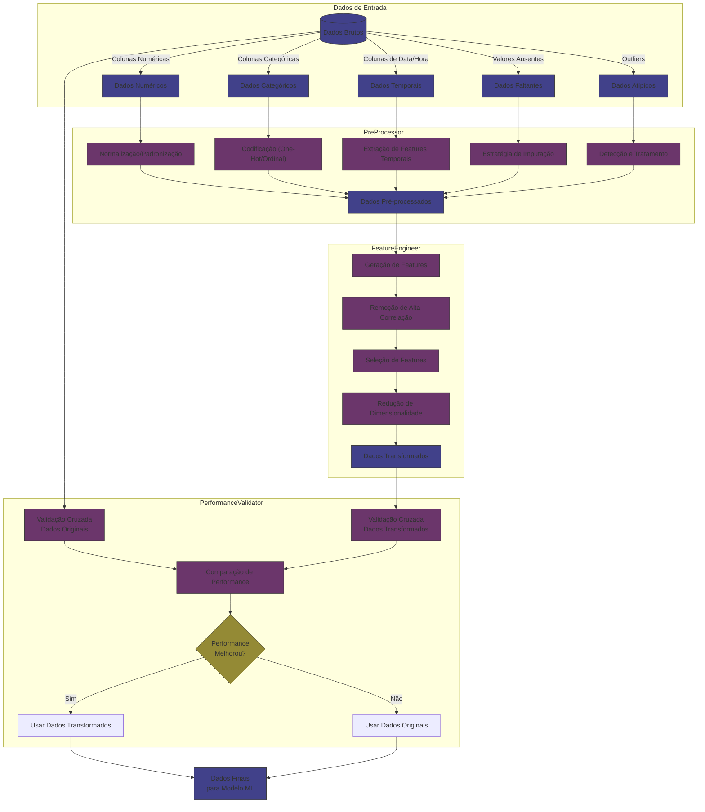

# CAFE (Component Automated Feature Engineer): Sistema de Engenharia Automática de Features

## Visão Geral

O CAFE (Component Automated Feature Engineer) é um sistema abrangente para automatizar o processamento de dados e a engenharia de features em projetos de machine learning. O sistema integra pré-processamento, engenharia de features e validação de performance em um pipeline completo e configurável.

Esta documentação fornece uma explicação detalhada da arquitetura, componentes e uso do sistema CAFE (Component Automated Feature Engineer).

## Instalação

```bash
pip install cafe-autofe
```

## Requisitos do Sistema

- Python 3.7+
- Dependências principais:
  - pandas>=1.3.0
  - numpy>=1.20.0
  - scikit-learn>=1.0.0
  - matplotlib>=3.4.0
  - seaborn>=0.11.0
  - joblib>=1.1.0
  - networkx>=3.4.2

## Arquitetura do Sistema

O sistema CAFE é composto por cinco componentes principais:

1. **PreProcessor**: Responsável pela limpeza e transformação inicial dos dados brutos.
2. **FeatureEngineer**: Gera e seleciona features de alta qualidade.
3. **PerformanceValidator**: Avalia e compara a performance de modelos treinados com diferentes conjuntos de dados.
4. **DataPipeline**: Integra os componentes em um pipeline unificado.
5. **Explorer**: Busca automaticamente a melhor configuração para um determinado conjunto de dados.

O diagrama abaixo ilustra a interação entre esses componentes:

```
               ┌───────────────────┐
               │      Explorer     │
               │  (Otimização de   │
               │   configuração)   │
               └─────────┬─────────┘
                         │
                         ▼
┌───────────────────┐   ┌───────────────────┐   ┌───────────────────┐
│   PreProcessor    │   │  FeatureEngineer  │   │ PerformanceValidator │
│  (Processamento   │──▶│  (Engenharia de   │──▶│  (Validação de    │
│     de dados)     │   │     features)     │   │   performance)    │
└─────────┬─────────┘   └─────────┬─────────┘   └─────────┬─────────┘
          │                       │                       │
          └───────────────────────┼───────────────────────┘
                                  │
                                  ▼
                        ┌───────────────────┐
                        │   DataPipeline    │
                        │  (Integração de   │
                        │   componentes)    │
                        └───────────────────┘
```

#### Transformação de Datasets pelo CAFE



## Exemplo de Uso Rápido

```python
import pandas as pd
from cafe import DataPipeline

# Carregar dados
df = pd.read_csv('dataset.csv')

# Criar pipeline com configurações padrão
pipeline = DataPipeline()

# Ajustar e transformar os dados
df_transformed = pipeline.fit_transform(df, target_col='target')

# Salvar o pipeline
pipeline.save('pipeline_model')
```

## Utilizando o Explorer para Encontrar a Melhor Configuração

```python
import pandas as pd
from cafe import Explorer, DataPipeline

# Carregar dados
df = pd.read_csv('dataset.csv')

# Criar Explorer
explorer = Explorer(target_col='target')

# Encontrar a melhor configuração
best_data = explorer.analyze_transformations(df)
best_config = explorer.get_best_pipeline_config()

# Criar e ajustar um pipeline com a melhor configuração
pipeline = DataPipeline(
    preprocessor_config=best_config.get('preprocessor_config', {}),
    feature_engineer_config=best_config.get('feature_engineer_config', {})
)

# Transformar os dados
df_transformed = pipeline.fit_transform(df, target_col='target')
```

## Componentes e Configurações Detalhadas

### 1. PreProcessor

O componente `PreProcessor` é responsável pelo pré-processamento dos dados brutos, realizando operações como tratamento de valores ausentes, detecção e tratamento de outliers, codificação de variáveis categóricas, normalização/padronização de dados e processamento de colunas de data/hora.

#### Configurações Disponíveis:

| Parâmetro | Tipo | Descrição | Valores possíveis |
|-----------|------|-----------|-------------------|
| `missing_values_strategy` | string | Estratégia para tratar valores ausentes | 'mean', 'median', 'most_frequent', 'knn' |
| `outlier_method` | string | Método para detecção de outliers | 'zscore', 'iqr', 'isolation_forest', 'none' |
| `categorical_strategy` | string | Estratégia para codificação de variáveis categóricas | 'onehot', 'ordinal', 'target', 'label', 'binary', 'multilabel' |
| `datetime_features` | lista | Features a extrair de colunas de data/hora | ['year', 'month', 'day', 'weekday', 'quarter', 'is_weekend', 'hour', 'minute', 'second', 'is_month_start', 'is_month_end', 'is_year_start', 'is_year_end', 'days_in_month'] |
| `scaling` | string | Método de normalização/padronização | 'standard', 'minmax', 'robust', 'maxabs', 'power', 'quantile', 'normalize', 'kernel' |
| `numeric_transformers` | lista | Transformadores adicionais para features numéricas | ['binarizer', 'kbins', 'function'] |
| `verbosity` | int | Nível de detalhamento dos logs | 0, 1, 2 |
| `scaling_params` | dict | Parâmetros específicos para o método de scaling | {} |
| `binarizer_threshold` | float | Limiar para o Binarizer | 0.0 a 1.0 |
| `kbins_n_bins` | int | Número de bins para KBinsDiscretizer | > 0 |
| `kbins_encode` | string | Estratégia de encoding para KBinsDiscretizer | 'onehot', 'ordinal', 'onehot-dense' |
| `power_transformer_method` | string | Método para PowerTransformer | 'yeo-johnson', 'box-cox' |
| `quantile_n_quantiles` | int | Número de quantis para QuantileTransformer | > 0 |
| `target_encoding_smoothing` | float | Fator de suavização para TargetEncoder | > 0.0 |

### 2. FeatureEngineer

O componente `FeatureEngineer` é responsável pela geração e seleção de features, implementando operações como geração de features polinomiais, remoção de features altamente correlacionadas, redução de dimensionalidade e seleção de features baseada em importância.

#### Configurações Disponíveis:

| Parâmetro | Tipo | Descrição | Valores possíveis |
|-----------|------|-----------|-------------------|
| `dimensionality_reduction` | string/None | Método de redução de dimensionalidade | 'pca', None |
| `feature_selection` | string/None | Método de seleção de features | 'variance', 'kbest', 'percentile', 'model', 'fwe', 'fpr', 'fdr', None |
| `feature_selection_params` | dict | Parâmetros específicos para seleção de features | {} |
| `generate_features` | bool | Se deve gerar features polinomiais | True, False |
| `correlation_threshold` | float | Limiar para detecção de alta correlação | 0.0 a 1.0 |
| `min_pca_components` | int | Número mínimo de componentes PCA | > 0 |
| `task` | string | Tipo de tarefa (para métodos supervisionados) | 'classification', 'regression' |
| `verbosity` | int | Nível de detalhamento dos logs | 0, 1, 2 |

#### Parâmetros de Seleção de Features:

Para o parâmetro `feature_selection_params`, as opções variam de acordo com o método de seleção:

- Para `kbest`:
  ```python
  {
      'k': 10,  # Número de features a selecionar
      'score_func': 'mutual_info'  # 'mutual_info', 'f_classif', 'chi2' (para classificação) ou 'f_regression' (para regressão)
  }
  ```

- Para `percentile`:
  ```python
  {
      'percentile': 20,  # Percentual de features a selecionar
      'score_func': 'mutual_info'
  }
  ```

- Para `model`:
  ```python
  {
      'threshold': 'mean',  # 'mean', 'median' ou valor numérico
      'estimator': None  # Se None, usa RandomForest por padrão
  }
  ```

- Para `fwe`, `fpr`, `fdr`:
  ```python
  {
      'alpha': 0.05,  # Nível de significância
      'score_func': 'mutual_info'
  }
  ```

### 3. PerformanceValidator

O componente `PerformanceValidator` é responsável por avaliar e comparar a performance de modelos treinados com diferentes conjuntos de dados, utilizando validação cruzada para estimativas robustas e decidindo automaticamente qual conjunto de dados usar.

#### Configurações Disponíveis:

| Parâmetro | Tipo | Descrição | Valores possíveis |
|-----------|------|-----------|-------------------|
| `max_performance_drop` | float | Máxima queda de performance permitida | 0.0 a 1.0 (ex: 0.05 = 5%) |
| `cv_folds` | int | Número de folds para validação cruzada | > 0 |
| `metric` | string | Métrica para avaliar performance | 'accuracy', 'f1', 'rmse', 'r2' |
| `task` | string | Tipo de tarefa | 'classification', 'regression' |
| `base_model` | string | Modelo base para avaliação | 'rf', 'lr', 'knn' |
| `verbose` | bool | Se deve mostrar logs detalhados | True, False |

### 4. DataPipeline

O componente `DataPipeline` integra o `PreProcessor`, `FeatureEngineer` e `PerformanceValidator` em um único pipeline unificado, combinando todas as etapas de processamento de forma sequencial e gerenciando o fluxo de dados entre os componentes.

#### Configurações Disponíveis:

| Parâmetro | Tipo | Descrição | Valores possíveis |
|-----------|------|-----------|-------------------|
| `preprocessor_config` | dict | Configuração para o preprocessador | Ver configurações do PreProcessor |
| `feature_engineer_config` | dict | Configuração para o engenheiro de features | Ver configurações do FeatureEngineer |
| `validator_config` | dict | Configuração para o validador de performance | Ver configurações do PerformanceValidator |
| `auto_validate` | bool | Se deve aplicar validação automática | True, False |

### 5. Explorer

O componente `Explorer` automatiza a busca pela melhor configuração para um conjunto de dados específico, testando diferentes combinações de configurações, avaliando cada configuração usando heurísticas e retornando a melhor configuração encontrada.

#### Principais Métodos:

- `analyze_transformations(df)`: Testa diferentes transformações e retorna o melhor dataset
- `get_best_pipeline_config()`: Retorna a configuração ótima do pipeline
- `create_optimal_pipeline()`: Cria um pipeline otimizado
- `visualize_transformations(output_path=None)`: Visualiza a árvore de transformações
- `get_transformation_statistics()`: Fornece estatísticas detalhadas sobre as transformações
- `export_transformation_graph(output_path)`: Exporta a árvore em formato GraphML
- `get_feature_importance_analysis(df)`: Analisa importância de features antes e depois

## Avançado: Transformadores Específicos

### Transformadores no PreProcessor:

#### Padronização e Normalização:
- **StandardScaler**: Padroniza features pela remoção da média e escala para variância unitária.
- **MinMaxScaler**: Escala features para um intervalo específico (geralmente [0, 1]).
- **RobustScaler**: Usa estatísticas robustas a outliers para escalar features.
- **MaxAbsScaler**: Escala pelo valor máximo absoluto.
- **Normalizer**: Normaliza amostras para norma unitária.

#### Transformações Não-Lineares:
- **PowerTransformer**: Aplica transformações 'yeo-johnson' ou 'box-cox' para aproximar distribuição normal.
- **QuantileTransformer**: Transforma features baseada em quantis.
- **KBinsDiscretizer**: Discretiza features contínuas em intervalos.

#### Codificação Categórica:
- **OneHotEncoder**: Codificação one-hot para variáveis categóricas.
- **OrdinalEncoder**: Codificação ordinal para variáveis categóricas.
- **LabelBinarizer**: Binariza rótulos.
- **LabelEncoder**: Codifica rótulos com valores entre 0 e n_classes-1.
- **MultiLabelBinarizer**: Binariza múltiplos rótulos.
- **TargetEncoder**: Substitui variáveis categóricas pela média do target.

### Selecionadores de Features:

- **SelectKBest**: Seleciona as k melhores features.
- **SelectPercentile**: Seleciona um percentual das melhores features.
- **SelectFromModel**: Utiliza um modelo para selecionar features relevantes.
- **SelectFwe**: Controle de erro familiar por teste múltiplo.
- **SelectFpr**: Seleciona features baseado em false positive rate.
- **SelectFdr**: Seleciona features baseado em false discovery rate.
- **VarianceThreshold**: Remove features com baixa variância.

## Exemplos de Configurações Completas

### 1. Configuração para Dados com Valores Ausentes

```python
preprocessor_config = {
    'missing_values_strategy': 'knn',  # Usa KNN para imputação
    'outlier_method': 'none',          # Desativa detecção de outliers
    'scaling': 'robust',               # Usa escalonamento robusto
    'verbosity': 1
}

feature_engineer_config = {
    'correlation_threshold': 0.9,      # Limiar mais permissivo
    'generate_features': False,        # Desativa geração de features
    'feature_selection': None
}

pipeline = DataPipeline(
    preprocessor_config=preprocessor_config,
    feature_engineer_config=feature_engineer_config
)
```

### 2. Configuração para Alta Dimensionalidade

```python
preprocessor_config = {
    'missing_values_strategy': 'median',
    'scaling': 'standard'
}

feature_engineer_config = {
    'dimensionality_reduction': 'pca',
    'feature_selection': 'model',
    'feature_selection_params': {
        'threshold': 'mean'
    },
    'correlation_threshold': 0.8,
    'generate_features': False
}

pipeline = DataPipeline(
    preprocessor_config=preprocessor_config,
    feature_engineer_config=feature_engineer_config,
    auto_validate=True
)
```

### 3. Configuração para Dados Categóricos de Alta Cardinalidade

```python
preprocessor_config = {
    'categorical_strategy': 'target',
    'target_encoding_smoothing': 10.0,
    'scaling': 'standard'
}

feature_engineer_config = {
    'feature_selection': 'kbest',
    'feature_selection_params': {
        'k': 15,
        'score_func': 'mutual_info'
    }
}

pipeline = DataPipeline(
    preprocessor_config=preprocessor_config,
    feature_engineer_config=feature_engineer_config
)
```

### 4. Configuração para Dados Temporais

```python
preprocessor_config = {
    'datetime_features': ['year', 'month', 'day', 'weekday', 'is_weekend', 'quarter'],
    'scaling': 'minmax'
}

feature_engineer_config = {
    'correlation_threshold': 0.85,
    'generate_features': True
}

pipeline = DataPipeline(
    preprocessor_config=preprocessor_config,
    feature_engineer_config=feature_engineer_config
)
```

### 5. Configuração para Transformação Avançada de Variáveis Numéricas

```python
preprocessor_config = {
    'scaling': 'power',
    'power_transformer_method': 'yeo-johnson',
    'numeric_transformers': ['kbins'],
    'kbins_n_bins': 10,
    'kbins_encode': 'ordinal'
}

feature_engineer_config = {
    'feature_selection': 'percentile',
    'feature_selection_params': {
        'percentile': 30
    }
}

pipeline = DataPipeline(
    preprocessor_config=preprocessor_config,
    feature_engineer_config=feature_engineer_config
)
```

## Novas Funcionalidades CAFE

### 1. ReportDataPipeline

A classe `ReportDataPipeline` é dedicada à análise de dados e geração de relatórios textuais. Ela extrai informações relevantes sobre valores ausentes, outliers, importância de features e transformações aplicadas.

### 2. ReportVisualizer

A classe `ReportVisualizer` é especializada na criação de visualizações gráficas a partir dos relatórios gerados. Ela fornece representações visuais claras e informativas para facilitar a interpretação dos dados.

## Funcionalidades do ReportDataPipeline

### Análise de Valores Ausentes
```python
missing_report = reporter.get_missing_values()
```
Esta função analisa os valores ausentes no dataset e retorna um DataFrame com:
- **coluna**: Nome da coluna contendo valores ausentes
- **valores_ausentes**: Número total de valores ausentes
- **porcentagem**: Percentual de valores ausentes
- **recomendacao**: Recomendações personalizadas para tratamento

### Análise de Outliers
```python
outliers_report = reporter.get_outliers()
```
Esta função detecta outliers em colunas numéricas e retorna um DataFrame com:
- **coluna**: Nome da coluna contendo outliers
- **num_outliers**: Número de outliers detectados
- **porcentagem**: Percentual de valores considerados outliers
- **limite_inferior/limite_superior**: Limites para detecção de outliers
- **min/max**: Valores mínimo e máximo na coluna
- **recomendacao**: Estratégias recomendadas para tratamento

### Análise de Importância de Features
```python
importance_report = reporter.get_feature_importance()
```
Esta função avalia a importância das features para a variável alvo e retorna um DataFrame com:
- **feature**: Nome da feature
- **importance**: Valor numérico de importância
- **normalized_importance**: Importância normalizada em percentual
- **categoria**: Classificação da importância (Muito Alta, Alta, Média, Baixa, Muito Baixa)

### Análise de Transformações Aplicadas
```python
transformations_report = reporter.get_transformations()
```
Esta função fornece informações detalhadas sobre transformações aplicadas pelo pipeline CAFE, retornando um dicionário com:
- **preprocessamento**: Informações sobre transformações de preprocessamento
- **engenharia_features**: Configurações de engenharia de features aplicadas
- **estatisticas**: Métricas sobre redução de dimensionalidade e ganho de performance
- **validacao**: Resultados da validação de performance comparando datasets original e transformado

### Resumo Conciso
```python
summary = reporter.get_report_summary()
```
Esta função gera um resumo conciso com as principais informações e recomendações em formato de dicionário, contendo:
- **dados**: Informações gerais sobre o dataset
- **valores_ausentes**: Estatísticas e recomendações sobre valores ausentes
- **outliers**: Estatísticas e recomendações sobre outliers
- **transformacoes**: Informações e recomendações sobre as transformações aplicadas

### Relatório Completo
```python
report = reporter.generate_report(output_file="relatorio.txt")
```
Esta função gera um relatório completo em formato de texto com todas as análises e recomendações, opcionalmente salvando o resultado em um arquivo.

## Funcionalidades do ReportVisualizer

### Visualização de Valores Ausentes
```python
fig = visualizer.visualize_missing_values(missing_report)
```
Cria um gráfico de barras horizontais mostrando as colunas com valores ausentes e suas proporções.

### Visualização de Outliers
```python
fig = visualizer.visualize_outliers(outliers_report, df)
```
Cria boxplots para as colunas com maior quantidade de outliers, mostrando limites de detecção.

### Visualização de Importância de Features
```python
fig = visualizer.visualize_feature_importance(importance_report)
```
Cria um gráfico de barras horizontais com código de cores para visualizar a importância relativa das features.

### Visualização de Transformações
```python
fig = visualizer.visualize_transformations(validation_results, transformation_stats)
```
Cria um painel com 4 gráficos mostrando:
1. Comparação de performance antes/depois das transformações
2. Comparação do número de features antes/depois
3. Performance por fold de validação cruzada
4. Resumo textual dos resultados da transformação

### Visualização de Distribuição de Dados
```python
fig = visualizer.visualize_data_distribution(df, columns=features_list)
```
Cria histogramas com curvas KDE para visualizar a distribuição das features selecionadas.

### Visualização de Matriz de Correlação
```python
fig = visualizer.visualize_correlation_matrix(df, target_col='target')
```
Cria um heatmap de correlações entre features e um gráfico adicional com correlações em relação à variável alvo.

## Exemplo de Uso Integrado

```python
# Importações
from cafe.data_pipeline import DataPipeline
from cafe.report_datapipeline import ReportDataPipeline
from cafe.report_visualizer import ReportVisualizer

# Criar e aplicar pipeline CAFE
pipeline = DataPipeline(...)
transformed_df = pipeline.fit_transform(df, target_col='target')

# Criar instâncias para relatórios e visualizações
reporter = ReportDataPipeline(
    df=df,
    target_col='target',
    preprocessor=pipeline.preprocessor,
    feature_engineer=pipeline.feature_engineer,
    validator=pipeline.validator
)
visualizer = ReportVisualizer()

# Gerar relatório de valores ausentes
missing_report = reporter.get_missing_values()

# Visualizar valores ausentes
fig_missing = visualizer.visualize_missing_values(missing_report)
fig_missing.savefig("missing_values.png")

# Gerar relatório completo
report = reporter.generate_report(output_file="cafe_report.txt")
```

## Uso Independente

As classes podem ser usadas de forma independente:

### Apenas para Análise de Dados (sem pipeline CAFE)
```python
# Criar apenas o reporter
reporter = ReportDataPipeline(df=seu_dataframe, target_col='coluna_alvo')

# Gerar relatórios
missing_report = reporter.get_missing_values()
outliers_report = reporter.get_outliers()
importance_report = reporter.get_feature_importance()

# Criar relatório completo
report = reporter.generate_report(output_file="relatorio.txt")
```

### Apenas para Visualizações
```python
# Criar visualizador
visualizer = ReportVisualizer()

# Criar visualizações de distribuição
fig = visualizer.visualize_data_distribution(seu_dataframe)
fig.savefig("distribuicoes.png")

# Criar visualizações de correlação
fig_corr = visualizer.visualize_correlation_matrix(seu_dataframe)
fig_corr.savefig("correlacoes.png")
```

## Benefícios

1. **Compreensão aprofundada dos dados**: Obtenha insights detalhados sobre valores ausentes, outliers e características dos dados.

2. **Avaliação de transformações**: Avalie objetivamente o impacto das transformações aplicadas pelo CAFE na dimensionalidade e performance.

3. **Relatórios automatizados**: Gere relatórios detalhados com recomendações específicas para tratamento de dados.

4. **Visualizações informativas**: Transforme análises complexas em visualizações claras para facilitar a interpretação.

5. **Fluxo de trabalho documentado**: Mantenha um registro completo das análises e decisões tomadas durante o processamento de dados.

## Perguntas Frequentes

### Quando devo usar o CAFE?

O CAFE é especialmente útil quando:
- Você tem datasets complexos com diferentes tipos de dados
- Precisa automatizar o processo de pré-processamento e feature engineering
- Deseja garantir que transformações melhoram a performance do modelo
- Tem datasets com características temporais ou categóricas que precisam de tratamento específico

### O CAFE funciona com grandes conjuntos de dados?

Sim, mas para conjuntos de dados muito grandes é recomendável:
- Desativar a geração de features (`generate_features=False`)
- Aumentar o limiar de correlação (`correlation_threshold=0.9`)
- Considerar usar um método mais simples para outliers (`outlier_method='zscore'`)
- Usar o Explorer em uma amostra representativa dos dados

### Como interpreto os resultados da validação?

Os resultados da validação incluem:
- `performance_original`: Performance nos dados originais
- `performance_transformed`: Performance nos dados transformados
- `performance_diff`: Diferença absoluta de performance
- `performance_diff_pct`: Diferença percentual de performance
- `best_choice`: Melhor opção ('original' ou 'transformed')
- `feature_reduction`: Percentual de redução de features

Use esses valores para entender o impacto das transformações na performance do modelo.

### É possível customizar o CAFE para tarefas específicas?

Sim, o CAFE é altamente configurável. Você pode ajustar as estratégias de pré-processamento para diferentes tipos de dados, configurar diferentes métodos de engenharia de features, definir seus próprios critérios de validação e estender as classes com métodos customizados para necessidades específicas.

## Licença

Este projeto está licenciado sob a Licença MIT - veja o arquivo [LICENSE](LICENSE) para detalhes.

## Contribuindo

Contribuições são bem-vindas! Por favor, sinta-se à vontade para enviar um Pull Request.

## Autores

- CAFE Team

## Conclusão

O CAFE (Component Automated Feature Engineer) é um sistema avançado de processamento de dados e engenharia de features que auxilia na automação de uma das etapas mais críticas e demoradas no desenvolvimento de modelos de machine learning. Suas características principais incluem:

- **Robustez**: Lida adequadamente com diferentes tipos de dados, valores ausentes e outliers
- **Flexibilidade**: Altamente configurável para diferentes necessidades e tipos de datasets
- **Performance**: Incorpora validação automática para garantir melhoria na qualidade dos modelos
- **Usabilidade**: Interface simples e padronizada seguindo o estilo scikit-learn

O sistema é particularmente útil para cientistas de dados e engenheiros de machine learning que buscam automatizar e otimizar o processo de preparação de dados, permitindo que se concentrem em aspectos mais estratégicos do desenvolvimento de modelos e interpretação de resultados.

Com a combinação de pré-processamento automatizado, engenharia de features inteligente e validação de performance, o CAFE (Component Automated Feature Engineer) representa um avanço significativo na direção da democratização do machine learning e da automação de processos de dados.

## Agradecimentos

- [Scikit-learn](https://scikit-learn.org/stable/): Biblioteca base usada para implementação dos algoritmos de ML
- [Pandas](https://pandas.pydata.org/docs/): Biblioteca para manipulação de dados usada extensivamente pelo CAFE