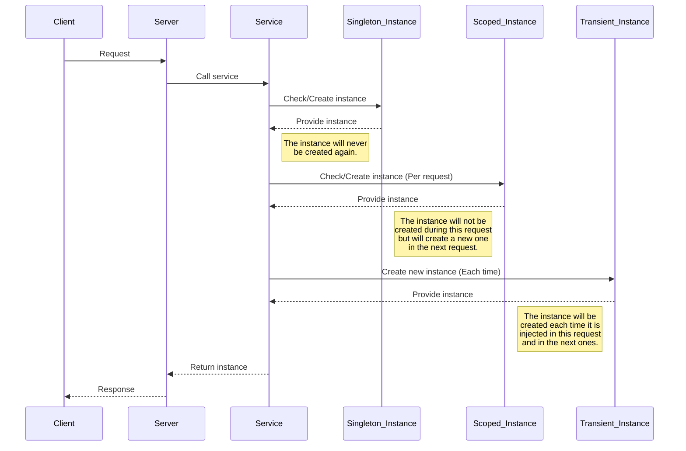

# Dependency Injection

## Introduction

Dependency injection is a design pattern that allows objects to receive their dependencies externally, rather than creating them themselves. This approach facilitates component management and promotes more modular and maintainable code.

## Purpose

- Simplifies unit testing.
- Facilitates maintenance and scalability.
- Reduces coupling between components.

## Importance

- Improves code flexibility.
- Allows greater reuse of components.
- Facilitates the injection of different implementations or configurations at runtime.

## Types

In the context of dependency injection, there are three main types of dependencies: `Singleton`, `Transient`, and `Scoped`. Each differs in how and when service instances are created throughout the application's lifecycle. These different ways of managing dependencies allow for better control over resource usage, efficiency, and state consistency in different application contexts.

### Singleton

**Description**: A single instance of the dependency is created and shared throughout the application's lifetime.

**Use Cases**: Used for configuration services, database connections, or any shared resource.

### Scoped

**Description**: A single instance of the dependency is created and shared during the lifecycle of a request.

**Use Cases**: Suitable for services that maintain state and need to be consistent during an HTTP request.

### Transient

**Description**: A new instance of the dependency is created each time it is requested.

**Use Cases**: Ideal for lightweight services that do not maintain state and are short-lived.



## Integration

There are three methods to store dependencies as needed: `add_singleton`, `add_scoped`, `add_transient`.

```python
from cafeto import App

app: App = App()

app.add_singleton()
app.add_scoped()
app.add_transient()
```

In the context of dependency injection, there are two main approaches: based on `interfaces` or `classes`. Below, each is explained and detailed when it is more appropriate to use one or the other.

## Interface-Based Dependency Injection

This approach involves defining an interface and associating it with a concrete class. Although Python does not have interfaces as such, it is possible to use abstract classes with the `ABC` (Abstract Base Classes) module to achieve similar functionality.

**When to Use**:

- **Flexibility**: Allows easily changing the implementation of the interface without modifying the dependent code.
- **Unit Testing**: Facilitates the creation of mock objects for testing.
- **Decoupling**: Reduces direct dependency between components, improving code maintainability.

```python
from abc import ABC
from typing import Optional

from cafeto import App

class AUserService(ABC):
    async def create_user(self, user: CreateUserRequestDto) -> bool:
        ...

    async def get_by_id(self, id: int) -> Optional[UserResponseDto]:
        ...

class UserService(AUserService):
    async def create_user(self, user: CreateUserRequestDto) -> bool:
        try:
            await <some_database_connection>.insert('users', user) #(1)
            return True
        except:
            return False
    
    async def get_by_id(self, id: int) -> Optional[UserResponseDto]:
        try:
            user = await <some_database_connection>.select('users', id) #(2)
            return UserResponseDto(user)
        except:
            return None

app: App = App()
app.add_scoped(AUserService, UserService) # Store service
```

1. !!! warning
       Simulated service for the example.

2. !!! warning
       Simulated service for the example.

In the example above, the dependency is stored using `AUserService` and `UserService`.

### Why is this useful?

Suppose that later in the project, it is required not to store users in a database but to send them to a microservice. In that case, we can create another class called `UserServiceToService` with the same methods, without needing to delete the current `UserService` class. This means that it will not be necessary to change the service call in each endpoint. Additionally, it allows us to keep the original `UserService` class in case it is needed in the future.

This approach allows:

- **Flexibility**: Changing the implementation of services without affecting the dependent code.
- **Decoupling**: Maintaining a clear separation between the interface definition and its implementation, improving maintainability.
- **Reuse**: Allowing multiple implementations to coexist and be used in different contexts as needed.

Now it is important to know how to inject the dependency, and for this, it is essential **not** to use `UserService` directly but `AUserService`, as it is through this interface that `UserService` will be reached. This ensures that the system can easily change the implementation of `AUserService` without affecting the dependent code, allowing greater flexibility and decoupling in your application.

## Class-Based Dependency Injection

This approach involves directly injecting a concrete class without using interfaces or abstract classes. It is less flexible but can be suitable for simple and direct implementations.

**When to Use**:

- **Simplicity**: Suitable for small projects or when the implementation is not expected to change.
- **Less Overhead**: No need to define abstract classes or interfaces, simplifying development.

```python
class CacheUserService:
    async def create_user(self, user: CreateUserRequestDto) -> bool:
        try:
            await <some_cache_connection>.insert('users', user) #(1)
            return True
        except:
            return False
    
    async def get_by_id(self, id: int) -> Optional[UserResponseDto]:
        try:
            user = await <some_cache_connection>.select('users', id) #(2)
            return UserResponseDto(user)
        except:
            return None

app: App = App()
app.add_scoped(CacheUserService) # Store service
```

1. !!! warning
       Simulated service for the example.

2. !!! warning
       Simulated service for the example.

In this case, unlike the previous example, only `CacheUserService` is used. This is because, during the project definition, it was estimated that the likelihood of this service changing is almost nil. Therefore, this approach was considered the most appropriate for this particular case.

To inject this dependency, it is necessary to use `CacheUserService` directly, as there is no interface or abstract class associated with this implementation.

## Comparison and Use in Python

In Python, since there are no formal interfaces like in other languages, it is possible to use abstract classes from the ABC module to achieve similar functionality. Here is a general comparison:

**Interface-Based Injection (ABC)**:

- **Pros**: Flexibility, ease of unit testing, less coupling.
- **Cons**: May add additional complexity.

**Class-Based Injection**:

- **Pros**: Simplicity, faster development.
- **Cons**: Less flexibility, harder to change or test.

## Generator

The generator is another (optional) parameter when registering a dependency. Its function is to provide greater control over how the dependency is created and stored. It is a `Callable` that receives the necessary data for the registered dependency (`**data`).

```python
class AMyService:
    def __init__(self, other_service: AOtherService, extra_param: str) -> None:
        ...

class MyService:
    def __init__(self, other_service: AOtherService, extra_param: str) -> None:
        self.other_service: AOtherService = other_service
        self.extra_param: str = extra_param

def my_service_generator(**params):
    params['extra_param'] = 'Hello World!'
    return MyService(**params)

app.add_scoped(AMyService, MyService, my_service_generator)
```

The abstract class is not mandatory, so the code could also be simplified as follows:

```python
class MyService:
    def __init__(self, other_service: AOtherService, extra_param: str) -> None:
        self.other_service: AOtherService = other_service
        self.extra_param: str = extra_param

def my_service_generator(**params):
    params['extra_param'] = 'Hello World!'
    return MyService(**params)

app.add_scoped(MyService, my_service_generator)
```

This offers greater flexibility in dependency injection, as the generator allows not only customizing the creation of the dependency but also performing any additional actions as needed.

It is important to note that the generator will be invoked depending on the dependency's lifecycle (`Singleton`, `Scoped`, `Transient`):

- **Singleton**: The generator will be invoked only once during the entire project.
- **Scoped**: It will be executed once per request.
- **Transient**: It will be invoked each time the dependency needs to be injected.

## Override

Determining if the dependency registration is an override requires an additional parameter, which serves to replace an already registered dependency. This parameter must be passed as a keyword argument, meaning it must be explicitly referenced using the parameter name.

```python
app.add_scoped(MyService, override=True)
app.add_scoped(AMyService, MyService, override=True)
app.add_scoped(AMyService, MyService, my_generator, override=True)
```

## Removing Dependencies

To remove an existing dependency, you can use the `remove_<type>` method.

```python
app.remove_singleton(MyServiceSingleton)
app.remove_scoped(AMyServiceScoped)
app.remove_transient(AMyServiceTransient)
```

## Injecting Dependencies

Dependencies can be injected in various places, from the controller, DTO validation methods, and other dependencies. To make this possible, it is crucial to have previously stored them using one of the associated methods: `add_singleton`, `add_scoped`, or `add_transient`.

In the case of controllers, they will be injected directly into the action.

```python
from cafeto import App
from cafeto.mvc import BaseController
from cafeto.responses import Ok, NotFound

@app.controller()
class UserController(BaseController):
    @app.get('/get/{id}')
    async def get_by_id(self, id: int, service: AUserService) -> UserResponseDto:
        user = await service.get_by_id(id) #(1)
        # Your code here
```

1. !!! warning
       Simulated service for the example.

In the case of DTO validators, they are used in each of these.

```python
from typing import Any, Dict, List

from cafeto.models import BaseModel, validate
from cafeto.errors import FieldError, Error, ModelError

class CreateUserRequestDto(BaseModel):
    username: str
    password: str

    @validate('username')
    async def validate_username(value: str, data: Dict[str, Any], service: AUserService):
        await service.some_required_validation() #(1)
        # Your code here
    
    @validate()
    async def validate(value: str, data: Dict[str, Any], service: AUserService):
        await service.some_required_validation() #(2)
        # Your code here
```

1. !!! warning
       Simulated service for the example.

2. !!! warning
       Simulated service for the example.

In the case of other dependencies, they are injected from the class constructor.

```python
from abc import ABC
from typing import Optional

from cafeto import App

class AUserService(ABC):
    def __init__(self, some_service: ASomeService) -> None:
        ...

    async def create_user(self, user: CreateUserRequestDto) -> bool:
        ...

    async def get_by_id(self, id: int) -> Optional[UserResponseDto]:
        ...

class UserService(AUserService):
    def __init__(self, some_service: ASomeService) -> None:
        self.some_service = some_service

    async def create_user(self, user: CreateUserRequestDto) -> bool:
        await self.some_service.do_something_user(user) #(1)
        # Your code here.
    
    async def get_by_id(self, id: int) -> Optional[UserResponseDto]:
        await self.some_service.do_something_id(id) #(1)
        # Your code here.
```

1. !!! warning
       Simulated service for the example.

2. !!! warning
       Simulated service for the example.

It is important to clarify that once the first dependency is initiated, it will create a recursive system where each dependency will be analyzed to correctly inject each one where needed.

## Important Information

`Singleton` type dependencies, being permanent, are shared among different users who enter the system in each request. This means that the information stored in these should preferably be information that is not related to the user's session and is immutable.

### Why is this important?

1. If information related to the user's session is stored, it could overlap between different requests, creating a security hole that could allow unauthorized access to certain services.

2. If the information is mutable (regardless of type), it could be overwritten insecurely between concurrent requests. This is known as `Race Conditions`. Although there is a way to prevent it by using temporary resource locks, it is not recommended to avoid creating bottlenecks, as the lock can affect the overall system performance.

### Example

```python
import asyncio
from typing import List

class MyServiceSingleton:
    def __init__(self):
        self.values: List[int] = []
        self._lock = asyncio.Lock()

    async def add_value(self, value: int) -> None:
        async with self._lock:  # Block the resource
            self.values.append(value)

    async def get_values(self) -> List[int]:
        async with self._lock: # Block the resource
            return self.values
```

As shown in the example, this can cause undesired wait times. For this reason, it is recommended to opt for a `No Lock Contention` architecture to improve system efficiency.

## Conclusion

It is crucial to understand the three types of dependency injection (`Singleton`, `Transient`, and `Scoped`) and the two methods for implementing dependency injection, either through `interfaces` or `classes`. This understanding will allow you to design more flexible, maintainable, and scalable systems, adapting to the specific needs of each project.
