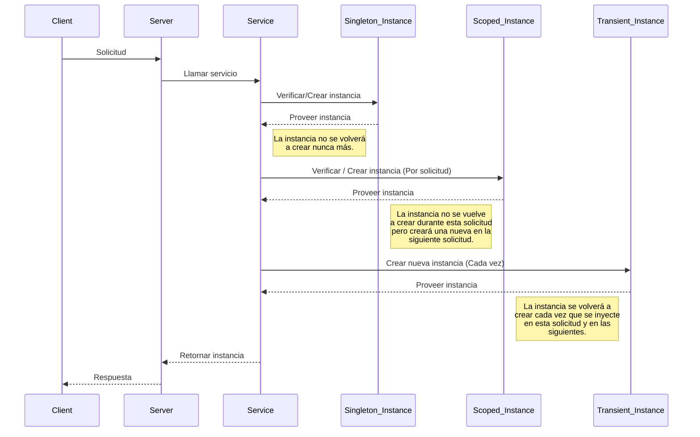

# Inyección de dependencias

## Introducción

La inyección de dependencias es un patrón de diseño que permite a los objetos recibir sus dependencias de manera externa, en lugar de crearlas por sí mismos. Este enfoque facilita la gestión de componentes y promueve un código más modular y mantenible.

## Para qué sirve

- Simplifica las pruebas unitarias.
- Facilita el mantenimiento y la escalabilidad.
- Reduce el acoplamiento entre componentes.

## Importancia

- Mejora la flexibilidad del código.
- Permite una mayor reutilización de componentes.
- Facilita la inyección de diferentes implementaciones o configuraciones en tiempo de ejecución.

## Tipos

En el contexto de la inyección de dependencias, existen tres tipos principales de dependencias: `Singleton`, `Transient` y `Scoped`. Cada una se diferencia en cómo y cuándo se crean las instancias de los servicios a lo largo del ciclo de vida de la aplicación. Estas distintas formas de gestionar las dependencias permiten un mejor control sobre el uso de recursos, la eficiencia y la coherencia del estado en diferentes contextos de la aplicación.

### Singleton

**Descripción**: Una única instancia de la dependencia es creada y compartida durante toda la vida de la aplicación.

**Casos de Uso**: Utilizado para servicios de configuración, conexiones de base de datos o cualquier recurso compartido.

### Scoped

**Descripción**: Una única instancia de la dependencia es creada y compartida durante el ciclo de vida de una solicitud (request).

**Casos de Uso**: Adecuado para servicios que mantienen estado y necesitan ser consistentes durante una solicitud HTTP.

### Transient

**Descripción**: Una nueva instancia de la dependencia es creada cada vez que se solicita.

**Casos de Uso**: Ideal para servicios ligeros que no mantienen estado y son de corta duración.



## Integración

Existen tres métodos para almacenar las dependencias según sea el caso: `add_singleton`, `add_scoped`, `add_transient`.

```python
from cafeto import App

app: App = App()

app.add_singleton()
app.add_scoped()
app.add_transient()
```

En el contexto de la inyección de dependencias, existen dos enfoques principales: basadas en `interfaces` o en `clases`. A continuación, se explica cada uno y se detalla cuándo es más apropiado utilizar uno u otro.

## Inyección de Dependencias Basada en Interfaces

Este enfoque implica definir una interfaz y asociarla con una clase concreta. Aunque Python no tiene interfaces como tal, es posible utilizar clases abstractas con el módulo `ABC` (Abstract Base Classes) para lograr una funcionalidad similar.

**Cuándo Usar**:

- **Flexibilidad**: Permite cambiar fácilmente la implementación de la interfaz sin modificar el código dependiente.
- **Pruebas Unitarias**: Facilita la creación de mock objects para pruebas.
- **Desacoplamiento**: Reduce la dependencia directa entre componentes, mejorando la mantenibilidad del código.

```python
from abc import ABC
from typing import Optional

from cafeto import App

class AUserService(ABC):
    async def create_user(self, user: CreateUserRequestDto) -> bool:
        ...

    async def get_by_id(self, id: int) -> Optional[UserResponseDto]:
        ...

class UserService(AUserService):
    async def create_user(self, user: CreateUserRequestDto) -> bool:
        try:
            await <some_database_connection>.insert('users', user) #(1)
            return True
        except:
            return False
    
    async def get_by_id(self, id: int) -> Optional[UserResponseDto]:
        try:
            user = await <some_database_connection>.select('users', id) #(2)
            return UserResponseDto(user)
        except:
            return None

app: App = App()
app.add_scoped(AUserService, UserService) # Store service
```

1. !!! warning
       Servicio simulado para el ejemplo.

2. !!! warning
       Servicio simulado para el ejemplo.

En el ejemplo anterior, se almacena la dependencia utilizando `AUserService` y `UserService`.

### ¿Por qué es esto útil?

Supongamos que, más adelante en el proyecto, se requiere no almacenar los usuarios en una base de datos, sino enviarlos a un microservicio. En ese caso, podemos crear otra clase llamada `UserServiceToService` con los mismos métodos, sin necesidad de eliminar la clase actual `UserService`. Esto implica que no será necesario cambiar, en cada endpoint, la llamada al servicio. Además, nos permite conservar la clase original `UserService` en caso de llegar a ser requerida en el futuro.

Este enfoque permite:

- **Flexibilidad**: Cambiar la implementación de los servicios sin afectar el código dependiente.
- **Desacoplamiento**: Mantener una separación clara entre la definición de la interfaz y su implementación, lo que mejora la mantenibilidad.
- **Reutilización**: Permitir que múltiples implementaciones coexistan y se utilicen en diferentes contextos según sea necesario.

Ahora es importante saber cómo inyectar la dependencia, y para esto es indispensable **no** usar `UserService` directamente, sino `AUserService`, ya que es a través de esta interfaz como se llegará a `UserService`. Esto garantiza que el sistema pueda cambiar fácilmente la implementación de `AUserService` sin afectar el código dependiente, permitiendo una mayor flexibilidad y desacoplamiento en tu aplicación.

## Inyección de Dependencias Basada en Clases

Este enfoque implica inyectar directamente una clase concreta sin utilizar interfaces o clases abstractas. Es menos flexible pero puede ser adecuado para implementaciones simples y directas.

**Cuándo Usar**:

- **Simplicidad**: Adecuado para proyectos pequeños o cuando no se espera que la implementación cambie.
- **Menos Sobrecarga**: No necesitas definir clases abstractas o interfaces, lo que simplifica el desarrollo.

```python
class CacheUserService:
    async def create_user(self, user: CreateUserRequestDto) -> bool:
        try:
            await <some_cache_connection>.insert('users', user) #(1)
            return True
        except:
            return False
    
    async def get_by_id(self, id: int) -> Optional[UserResponseDto]:
        try:
            user = await <some_cache_connection>.select('users', id) #(2)
            return UserResponseDto(user)
        except:
            return None

app: App = App()
app.add_scoped(CacheUserService) # Store service
```

1. !!! warning
       Servicio simulado para el ejemplo.

2. !!! warning
       Servicio simulado para el ejemplo.

En este caso, a diferencia del ejemplo anterior, se utiliza únicamente `CacheUserService`. Esto se debe a que, durante la definición del proyecto, se estimó que las probabilidades de que este servicio cambie son casi nulas. Por lo tanto, este enfoque se consideró el más adecuado para este caso particular.

Para inyectar esta dependencia, es necesario usar `CacheUserService` directamente, ya que no se cuenta con una interfaz o clase abstracta asociada a esta implementación.

## Comparación y Uso en Python

En Python, dado que no existen interfaces formales como en otros lenguajes, es posible utilizar clases abstractas del módulo ABC para lograr una funcionalidad similar. Aquí tienes una comparación general:

**Inyección Basada en Interfaces (ABC)**:

- **Pros**: Flexibilidad, facilidad para pruebas unitarias, menor acoplamiento.
- **Contras**: Puede agregar complejidad adicional.

**Inyección Basada en Clases**:

- **Pros**: Simplicidad, desarrollo más rápido.
- **Contras**: Menor flexibilidad, más difícil de cambiar o probar.

## Generador (Generator)

El generador es otro parámetro (Opcional) al registrar una dependencia. Su función es brindar mayor control sobre cómo se crea y almacena dicha dependencia. Es un `Callable` que recibe como parámetro los datos necesarios para la dependencia registrada (`**data`).

```python
class AMyService:
    def __init__(self, other_service: AOtherService, extra_param: str) -> None:
        ...

class MyService:
    def __init__(self, other_service: AOtherService, extra_param: str) -> None:
        self.other_service: AOtherService = other_service
        self.extra_param: str = extra_param

def my_service_generator(**params):
    params['extra_param'] = 'Hello World!'
    return MyService(**params)

app.add_scoped(AMyService, MyService, my_service_generator)
```

La clase abstracta no es obligatoria, por lo que el código también podría simplificarse de esta forma:

```python
class MyService:
    def __init__(self, other_service: AOtherService, extra_param: str) -> None:
        self.other_service: AOtherService = other_service
        self.extra_param: str = extra_param

def my_service_generator(**params):
    params['extra_param'] = 'Hello World!'
    return MyService(**params)

app.add_scoped(MyService, my_service_generator)
```

Esto ofrece una mayor flexibilidad en la inyección de dependencias, ya que el generador permite no solo personalizar la creación de la dependencia, sino también realizar cualquier acción adicional según sea necesario.

Es importante tener en cuenta que el generador será invocado dependiendo del ciclo de vida de la dependencia (`Singleton`, `Scoped`, `Transient`):

- **Singleton**: El generador se invocará solo una vez durante todo el proyecto.
- **Scoped**: Se ejecutará una vez por cada solicitud.
- **Transient**: Será invocado cada vez que se necesite inyectar la dependencia.

## Sobreescribir (override)

Determinar si el registro de la dependencia es una sobreescritura requiere un parámetro adicional, el cual sirve para reemplazar una dependencia ya registrada. Este parámetro debe ser pasado como un argumento por palabra clave, es decir, debe referenciarse explícitamente usando el nombre del parámetro.

```python
app.add_scoped(MyService, override=True)
app.add_scoped(AMyService, MyService, override=True)
app.add_scoped(AMyService, MyService, my_generator, override=True)
```

## Remover dependencias

Para remover una dependencia ya existente se puede usar el método `remove_<type>`.

```python
app.remove_singleton(MyServiceSingleton)
app.remove_scoped(AMyServiceScoped)
app.remove_transient(AMyServiceTransient)
```

## Inyección de las dependencias

Las dependencias pueden ser inyectadas en varios lugares, desde el controlador, los métodos de validación de los DTO y otras dependencias. Para que esto sea posible es muy importante haberlas almacenado previamente con alguno de los métodos asociados a este `add_singleton`, `add_scoped` o `add_transient`.

En el caso de los controladores se inyectarán directamente en la acción.

```python
from cafeto import App
from cafeto.mvc import BaseController
from cafeto.responses import Ok, NotFound

@app.controller()
class UserController(BaseController):
    @app.get('/get/{id}')
    async def get_by_id(self, id: int, service: AUserService) -> UserResponseDto:
        user = await service.get_by_id(id) #(1)
        # Your code here
```

1. !!! warning
       Servicio simulado para el ejemplo.

En el caso de los validadores de los DTO se usan en cada uno de estos.

```python
from typing import Any, Dict, List

from cafeto.models import BaseModel, validate
from cafeto.errors import FieldError, Error, ModelError

class CreateUserRequestDto(BaseModel):
    username: str
    password: str

    @validate('username')
    async def validate_username(value: str, data: Dict[str, Any], service: AUserService):
        await service.some_required_validation() #(1)
        # Your code here
    
    @validate()
    async def validate(value: str, data: Dict[str, Any], service: AUserService):
        await service.some_required_validation() #(2)
        # Your code here
```

1. !!! warning
       Servicio simulado para el ejemplo.

2. !!! warning
       Servicio simulado para el ejemplo.

En el caso de las otras dependencias estas se inyectan desde el constructor de la clase.

```python
from abc import ABC
from typing import Optional

from cafeto import App

class AUserService(ABC):
    def __init__(self, some_service: ASomeService) -> None:
        ...

    async def create_user(self, user: CreateUserRequestDto) -> bool:
        ...

    async def get_by_id(self, id: int) -> Optional[UserResponseDto]:
        ...

class UserService(AUserService):
    def __init__(self, some_service: ASomeService) -> None:
        self.some_service = some_service

    async def create_user(self, user: CreateUserRequestDto) -> bool:
        await self.some_service.do_something_user(user) #(1)
        # Your code here.
    
    async def get_by_id(self, id: int) -> Optional[UserResponseDto]:
        await self.some_service.do_something_id(id) #(2)
        # Your code here.
```

1. !!! warning
       Servicio simulado para el ejemplo.

2. !!! warning
       Servicio simulado para el ejemplo.

Es importante aclarar que, una vez se inicia con la primera dependencia, esta creará un sistema recursivo donde se analizará cada dependencia para poder inyectar de forma correcta cada una de ellas donde se necesite.

## Información importante

Las dependencias de tipo `Singleton`, al ser permanentes, se comparten entre los diferentes usuarios que ingresan al sistema en cada solicitud. Esto significa que la información almacenada en estas debe ser, preferiblemente, información que no esté relacionada con la sesión del usuario y que sea inmutable.

### ¿Por qué es importante esto?

1. Si se almacena información relacionada con la sesión del usuario, esta podría solaparse entre solicitudes diferentes, generando un agujero de seguridad que podría permitir el acceso no autorizado a determinados servicios.

2. Si la información es mutable (independientemente del tipo), podría sobrescribirse de manera insegura entre solicitudes concurrentes. Esto es lo que se conoce como `Condiciones de carrera (Race Conditions)`. Aunque existe una forma de prevenirlo mediante el uso de bloqueos temporales del recurso, no se recomienda hacerlo para evitar generar cuellos de botella, ya que el bloqueo puede afectar el rendimiento general del sistema.

### Ejemplo

```python
import asyncio
from typing import List

class MyServiceSingleton:
    def __init__(self):
        self.values: List[int] = []
        self._lock = asyncio.Lock()

    async def add_value(self, value: int) -> None:
        async with self._lock:  # Block the resource
            self.values.append(value)

    async def get_values(self) -> List[int]:
        async with self._lock: # Block the resource
            return self.values
```

Como se muestra en el ejemplo, esto puede causar tiempos de espera no deseados. Por esta razón, se recomienda optar por una arquitectura sin bloqueos (`No Lock Contention`) para mejorar la eficiencia del sistema.

## Conclusión

Es crucial entender los tres tipos de inyección de dependencias (`Singleton`, `Transient` y `Scoped`) y los dos métodos para implementar la inyección de dependencias, ya sea a través de `interfaces` o `clases`. Esta comprensión te permitirá diseñar sistemas más flexibles, mantenibles y escalables, adaptándose a las necesidades específicas de cada proyecto.
