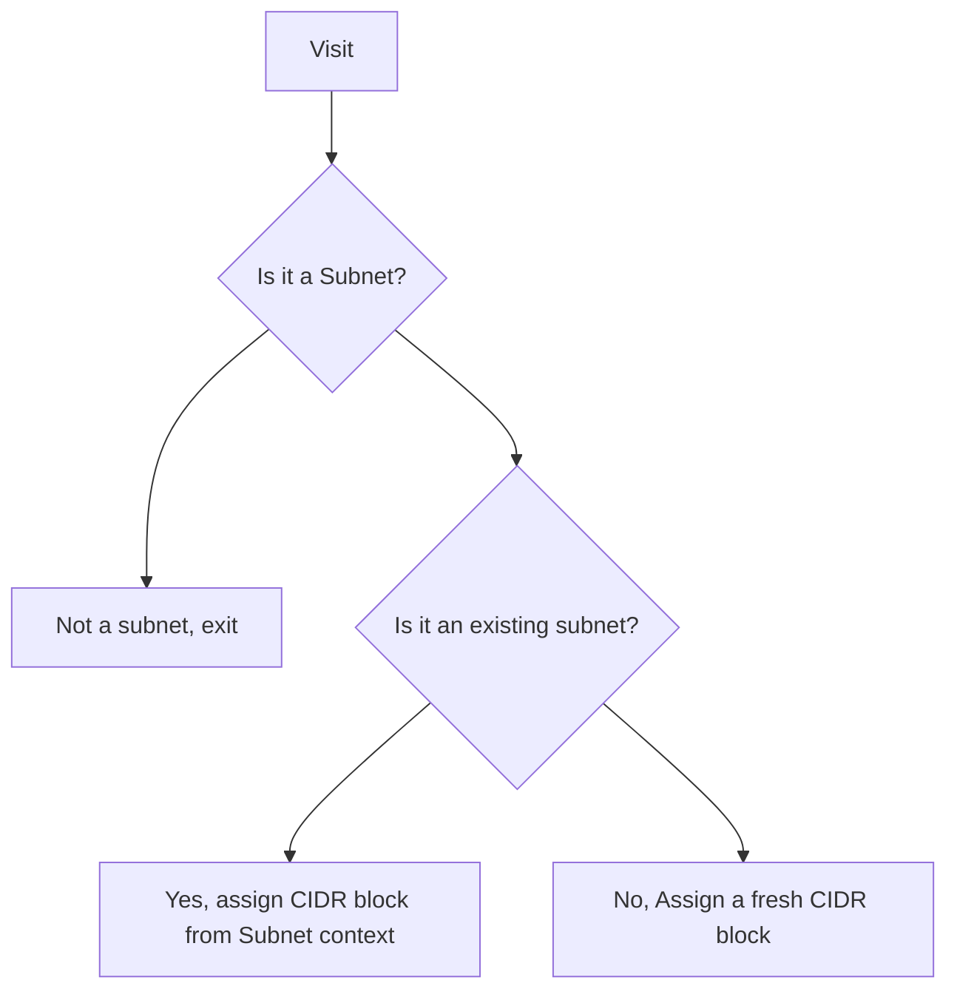

[](https://constructs.dev/packages/cdk-aspect-vpc-stateful-cidr-block-assigner)

# CDK Aspect for VPC Stateful CIDR Block Assignment

Updating Availability Zones (AZs) and subnets in an existing VPC within a deployed CDK stack presents a significant challenge when using the [ec2.Vpc construct](https://docs.aws.amazon.com/cdk/api/v2/docs/aws-cdk-lib.aws_ec2.Vpc.html). When introducing new AZs (e.g., from 2 to 3 AZs), CDK attempts to create new subnets for the additional AZ, but these new subnets' CIDR blocks conflict with existing subnet CIDRs. Attempting to do so results in the error message: "The CIDR 'X.Y.Z.0/24' conflicts with another subnet."

The reason is that CDK applications, by design, don't keep state between runs. This means when you try to modify the VPC by adding an AZ, the VPC construct is not aware of what CIDR ranges are already in use from previous deployments.

This project provides a CDK Aspect that alters Amazon VPC subnet CIDR block assignments to respect existing CIDR blocks when updating a CDK VPC construct.

The VpcStatefulCidrBlockAssigner is designed to maintain consistency in VPC subnet CIDR blocks across deployments, ensuring that existing subnets retain their assigned CIDR blocks while allowing for the addition of new subnets.

## Aspect Considerations

**This CDK Aspect does not follow CDK's best practices and is intended as a break-glass solution when the alternatives can't be used.**

Specifically, this CDK Aspect uses a [subnet context file](#generate-subnet-context-file) created by the user as a source of truth for deployed and assigned CIDR blocks. To keep the existing assignments between CIDR Blocks and Subnets, this aspect utilize the [escape hatches](https://docs.aws.amazon.com/cdk/v2/guide/cfn_layer.html) mechanism.

### Preferred Alternatives

* Migrate existing CDK stack to use [VPCv2](https://docs.aws.amazon.com/cdk/api/v2/docs/@aws-cdk_aws-ec2-alpha.VpcV2.html)
* Replace existing CDK stack with a new CDK stack with updated configuration

### Aspect Prerequisites

* VPC construct declares AZs using `availabilityZones` prop and not `maxAzs` prop; E.g., `availabilityZones: ['us-east-1a', 'us-east-1b']`
* You can only apply aspect to a CDK construct tree containing up to one VPC
* VPC construct and provided VPC ID must match

### Limitations

* Only supports IPv4
* One CIDR block per VPC

### General

* To ensure consistency between deployments, you must check in all `${VPC_ID}.subnets.context.json` files to your git repository, see [Generate Subnet Context File](#generate-subnet-context-file)
* Removing this aspect after first use will cause deployment issues

  * Since this CDK aspect overrides the CIDR blocks assigned by the VPC construct, removing this aspect after first use will cause subnets to be assigned their "default" CIDR blocks, resulting in resource replacement or a deployment errors

## General Availability Zone Migration Considerations

When migrating AWS resources between AZs, it's recommended to use the Expand/Shrink approach. This method involves expanding your VPC to include new AZs, deploy your application resources in the new AZs, and then gradually shrink the footprint in the AZs you want to migrate away from.

The shrinking process, which involves removing resources and subnets from the AZs you're migrating away from, requires extreme caution. Before deleting any AWS resources or subnets, it's essential to ensure that all critical workloads and data have been successfully migrated to the new AZs. Only after confirming that all resources have been safely migrated and that there are no dependencies on the old AZs should you proceed with deletion. Remember that deleting resources is irreversible, so always double-check and consider using temporary safeguards like disabling termination protection only when you're absolutely certain about the deletion.

## Usage Instructions

### Installation

Prerequisites:

* Node.js (v14 or later)
* AWS CDK v2.177.0 or compatible version

To install the package in your project:

```bash
npm install cdk-aspect-vpc-stateful-cidr-block-assigner
```

### Generate Subnet Context File

The VpcStatefulCidrBlockAssigner relies on a JSON file describing the current state of your VPC. The users are responsible for creating and updating this file before and after any change to their VPC state. To be aligned with CDK's terminology we refer to this file as the subnet context file.

This file should be named `{vpcId}.subnets.context.json` and placed in the project root or the specified `contextFileDirectory`.

The subnet context file holds a list of JSON objects describing each subnet inside a VPC:

```json
[
    {
        "Name": "SubnetName",
        "AvailabilityZone": "AvailabilityZone",
        "CidrBlock": "SubnetCidrBlock"
    },
    ...
]
```

This CDK aspect will try to use the values in the subnet context file to match between subnets and CIDR blocks during CDK synth time to prevent CIDR block conflicts when introducing or replacing VPC AZs.

I highly recommend to create and update this file manually only. Do not set up any automation around it since any changes done to your VPC should be done carefuly and responsibly, with high level of awareness.

To generate this file, use the following AWS CLI command:

```bash
export VPC_ID="{VPC ID}"
aws ec2 describe-subnets --filters Name=vpc-id,Values=${VPC_ID} --query "Subnets[*].{Name: Tags[?Key == 'aws-cdk:subnet-name'] | [0].Value, AvailabilityZone: AvailabilityZone, CidrBlock: CidrBlock}" > ${VPC_ID}.subnets.context.json
```

Replace `{VPC ID}` with your actual VPC ID.

### Getting Started

1. Import the VpcStatefulCidrBlockAssigner in your CDK stack:

```python
import { VpcStatefulCidrBlockAssigner } from 'cdk-aspect-vpc-stateful-cidr-block-assigner';
import * as cdk from 'aws-cdk-lib';
```

1. Apply the aspect to your VPC construct:

```python
const network = new Network(this, 'Network', {
  // ... your network construct configuration, this construct must contain up to one VPC construct
});


const vpcStatefulCidrBlockAssigner = new VpcStatefulCidrBlockAssigner({
  vpcId: 'vpc-01234567890abcdef'
});
cdk.Aspects.of(network).add(vpcStatefulCidrBlockAssigner, {
  priority: cdk.AspectPriority.MUTATING
});
```

The `priority: cdk.AspectPriority.MUTATING` option informs CDK this Aspect mutates the construct tree, and needs to be invoked before any readonly Aspects which are commonly used for security validations before deployment. E.g., [cdk-nag](https://github.com/cdklabs/cdk-nag).

### Configuration Options

The `VpcStatefulCidrBlockAssigner` accepts the following properties:

| Property | Type | Description | Example |
|----------|------|-------------|---------|
| vpcId | string | The ID of the VPC you want to manage. | 'vpc-01234567890abcdef' |
| contextFileDirectory | string (optional) | Custom directory path for the subnet context file. | 'path/to/context/' |
| availabilityZoneSubstitutions | Array<AvailabilityZoneSubstitution> (optional) | An array of AZ substitutions for reassigning CIDR blocks. | [{ source: 'us-east-1a', target: 'us-east-1b' }, { source: 'us-east-1c', target: 'us-east-1d' }] |

Example with all options:

```python
const vpcStatefulCidrBlockAssigner = new VpcStatefulCidrBlockAssigner({
  vpcId: 'vpc-01234567890abcdef',
  contextFileDirectory: 'path/to/context/',
  availabilityZoneSubstitutions: [
    { source: 'us-east-1a', target: 'us-east-1b' },
    { source: 'us-east-1c', target: 'us-east-1d' },
  ]
});
```

### Supported Actions

The VPC construct assigns [Logical IDs](https://docs.aws.amazon.com/cdk/v2/guide/identifiers.html#identifiers_logical_ids) to its subnets based on the order of `availabilityZones`. Any change to these Logical ID will cause a re-deployment of the resource.

Adding or removing AZs in the non-last spot of `availabilityZones` will cause a re-arrangement of the AZ order, which in turn, cause changes to the subnets' Logical IDs and a replacement.

#### Add Availability Zones

To add a new Availability Zone to your VPC:

1. Follow [Generate Subnet Context File](#generate-subnet-context-file) instructions to generate an updated subnet context file
2. Update your VPC configuration in your CDK stack to include the new AZ in the `availabilityZones` prop
3. Ensure the new AZ is added as the last (right-most) item in the `availabilityZones` array
4. [Optional] Use `npx cdk diff` command to inspect the upcoming changes
5. Run your CDK deployment command (e.g., `npx cdk deploy`)
6. Follow [Generate Subnet Context File](#generate-subnet-context-file) instructions to generate an updated subnet context file

Example:

```python
const vpc = new ec2.Vpc(this, 'MyVpc', {
  ipAddresses: ec2.IpAddresses.cidr('10.0.0.0/16'),
  availabilityZones: ['us-east-1a', 'us-east-1b', 'us-east-1c'], // Added 'us-east-1c'
  // ... other configuration options
});
```

The VpcStatefulCidrBlockAssigner will automatically assign CIDR blocks to the new subnets in the added AZ while preserving the existing CIDR block assignments for the other AZs.

#### Remove Availability Zones

To remove an Availability Zone from your VPC:

1. Follow [Generate Subnet Context File](#generate-subnet-context-file) instructions to generate an updated subnet context file
2. Make sure there are no AWS resources depending on subnets in the deleted AZs
3. Update your VPC configuration in your CDK stack to remove the AZ from the `availabilityZones` prop
4. Ensure you are only removing the last (right-most) AZ from the `availabilityZones` array
5. [Optional] Use `npx cdk diff` command to inspect the upcoming changes
6. Run your CDK deployment command (e.g., `npx cdk deploy`)
7. Follow [Generate Subnet Context File](#generate-subnet-context-file) instructions to generate an updated subnet context file

Example:

```python
const vpc = new ec2.Vpc(this, 'MyVpc', {
  ipAddresses: ec2.IpAddresses.cidr('10.0.0.0/16'),
  availabilityZones: ['us-east-1a', 'us-east-1b'], // Removed 'us-east-1c'
  // ... other configuration options
});
```

The VpcStatefulCidrBlockAssigner will automatically handle the removal of subnets in the deleted AZ while maintaining the CIDR block assignments for the remaining AZs.

#### Substitute Availability Zones

When AWS CloudFormation performs a replacement of an AWS resource it first deploys the new resource and then deletes the old resource. When substituting between AZs we want to re-use existing CIDR blocks, hence, we need to manually delete the subnets in the AZs we are substituting "to free up" the CIDR blocks for the new subnets.

Note: This diverges from IaC best practices and should be done with extreme caution.

To substitute one Availability Zone with another:

1. Follow [Generate Subnet Context File](#generate-subnet-context-file) instructions to generate an updated subnet context file
2. Update your VPC configuration in your CDK stack to replace the old AZ with the new one in the `availabilityZones` prop
3. Configure the VpcStatefulCidrBlockAssigner with the `availabilityZoneSubstitutions` option
4. Manually delete the subnets in the removed AZs
5. [Optional] Use `npx cdk diff` command to inspect the upcoming changes
6. Run your CDK deployment command (e.g., `npx cdk deploy`)
7. Remove the `availabilityZoneSubstitutions` option from VpcStatefulCidrBlockAssigner
8. Follow [Generate Subnet Context File](#generate-subnet-context-file) instructions to generate an updated subnet context file

Example:

```python
const vpc = new ec2.Vpc(this, 'MyVpc', {
  ipAddresses: ec2.IpAddresses.cidr('10.0.0.0/16'),
  availabilityZones: ['us-east-1c', 'us-east-1b'], // Replaced 'us-east-1a' with 'us-east-1c'
  // ... other configuration options
});

const vpcStatefulCidrBlockAssigner = new VpcStatefulCidrBlockAssigner({
  vpcId: 'vpc-01234567890abcdef',
  availabilityZoneSubstitutions: [
    { source: 'us-east-1b', target: 'us-east-1c' }
  ]
});

cdk.Aspects.of(vpc).add(vpcStatefulCidrBlockAssigner);
```

The VpcStatefulCidrBlockAssigner will reassign the CIDR blocks from the old AZ (us-east-1a) to the new AZ (us-east-1c) while maintaining the existing CIDR block assignments for other AZs.

### Example Migration Plan

Starting point: `availabilityZones: ['us-east-1a', 'us-east-1b']`
Goal: `availabilityZones: ['us-east-1a', 'us-east-1c']`
Requirement: Always have at least two active AZs

1. Expand by adding a new temporary 'non-goal' AZ: `availabilityZones: ['us-east-1a', 'us-east-1b', 'us-east-1d']`

   1. Deploy the application to the new AZ (us-east-1d)
   2. Test that the application is stable
2. Substitute original AZ with a goal AZ: `availabilityZones: ['us-east-1a', 'us-east-1c', 'us-east-1d']`

   1. Deploy the application to the new AZ (us-east-1c)
   2. Test that the application is stable
3. Shrink temporary 'non-goal' AZ: `availabilityZones: ['us-east-1a', 'us-east-1c']`

   1. Test that the application is stable

## CIDR Block Assignment Flow

CDK aspects are a powerful feature that allow you to apply cross-cutting changes to your CDK constructs. They work by implementing the `IAspect` interface, which defines a `visit` method. This method is called for each construct in the construct tree, allowing the aspect to inspect and modify the constructs as needed. The VpcStatefulCidrBlockAssigner uses this mechanism to intercept and modify subnet CIDR block assignments, ensuring consistency across deployments while respecting existing assignments.


