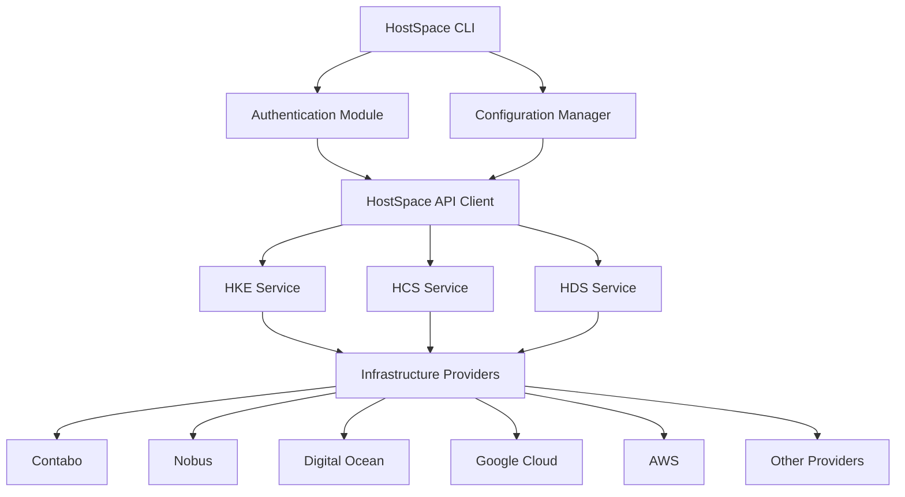

# HostSpace CLI

A command-line interface tool for managing HostSpace Cloud services, including Kubernetes (HKE), Containers (HCS), and Database (HDS) services.

## Overview

HostSpace CLI provides a unified interface to manage your cloud resources across multiple infrastructure providers. It simplifies the management of:

- HostSpace Kubernetes Engine (HKE)
- HostSpace Container Service (HCS)
- HostSpace Database Service (HDS)

## Architecture



### Key Components

1. **CLI Core**
   - Command parser and router
   - Error handling and logging
   - Output formatting (JSON, YAML, Table)

2. **Authentication Module**
   - Token-based authentication
   - API key management
   - Session handling

3. **Configuration Manager**
   - User preferences
   - Provider configurations
   - Environment management

4. **Service Modules**
   - HKE module for Kubernetes operations
   - HCS module for container management
   - HDS module for database operations

## Installation

### Quick Installation (Recommended)
```bash
# Install from Git repository
pip install git+https://github.com/hostspace/hostspace-cli.git
```

### Development Installation
```bash
# Clone the repository
git clone https://github.com/hostspace/hostspace-cli.git
cd hostspace-cli

# Install development dependencies
pip install -e ".[dev]"
```

After installation, verify that the CLI is working:
```bash
# Check available commands
hs --help

# Set up your environment (default is production)
hs env show

# Switch to development environment if needed
hs env set development

# Login with your API key
hs auth login
```

## Environment Management

The CLI supports both production and development environments. You can switch between them using:

```bash
# Show current environment
hs env show

# Switch to development environment
hs env set development

# Switch to production environment
hs env set production
```

### Environment Configuration
- **Production**: Uses `https://api.hostspace.cloud`
- **Development**: Uses `https://aether-api-dev.hostspacecloud.com`

## Basic Usage

```bash
# Authentication
hs auth login
hs auth logout
hs auth status

# Kubernetes (HKE) Operations
hs hke cluster list
hs hke cluster create
hs hke cluster delete <cluster-id>
hs hke node-pool add <cluster-id>

# Container Service (HCS) Operations
hs hcs app list
hs hcs app deploy
hs hcs app logs <app-id>
hs hcs app delete <app-id>

# Database Service (HDS) Operations
hs hds instance list
hs hds instance create
hs hds backup create <instance-id>
hs hds backup list <instance-id>
```

## Configuration

The CLI uses a configuration file located at `~/.hostspace/config.yaml`:

```yaml
auth:
  api_key: "your-api-key"
  endpoint: "https://api.hostspace.cloud"

providers:
  default: "contabo"
  regions:
    - name: "us-east"
      provider: "digital-ocean"
    - name: "eu-central"
      provider: "contabo"

output:
  format: "table"  # or json, yaml
  color: true
```

## Development Guide

### Project Structure

```
hostspace-cli/
├── README.md
├── setup.py
├── requirements/
│   ├── prod.txt         # Production dependencies
│   └── dev.txt          # Development dependencies
├── hostspace/
│   ├── __init__.py
│   ├── cli.py
│   ├── env_commands.py  # Environment management
│   ├── auth/
│   │   ├── __init__.py
│   │   └── commands.py
│   ├── hke/
│   │   ├── __init__.py
│   │   └── commands.py
│   ├── hcs/
│   │   ├── __init__.py
│   │   └── commands.py
│   ├── hds/
│   │   ├── __init__.py
│   │   └── commands.py
│   └── utils/
│       ├── __init__.py
│       ├── config.py
│       └── api.py
└── tests/
    └── ...
```

### Getting Started with Development

1. Clone the repository:
```bash
git clone https://github.com/hostspace/hostspace-cli.git
cd hostspace-cli
```

2. Install development dependencies:
```bash
pip install -e ".[dev]"
```

3. Run tests:
```bash
pytest
```

4. Format code:
```bash
black .
isort .
```

## Contributing

We welcome contributions! Please see our [Contributing Guide](CONTRIBUTING.md) for details.
