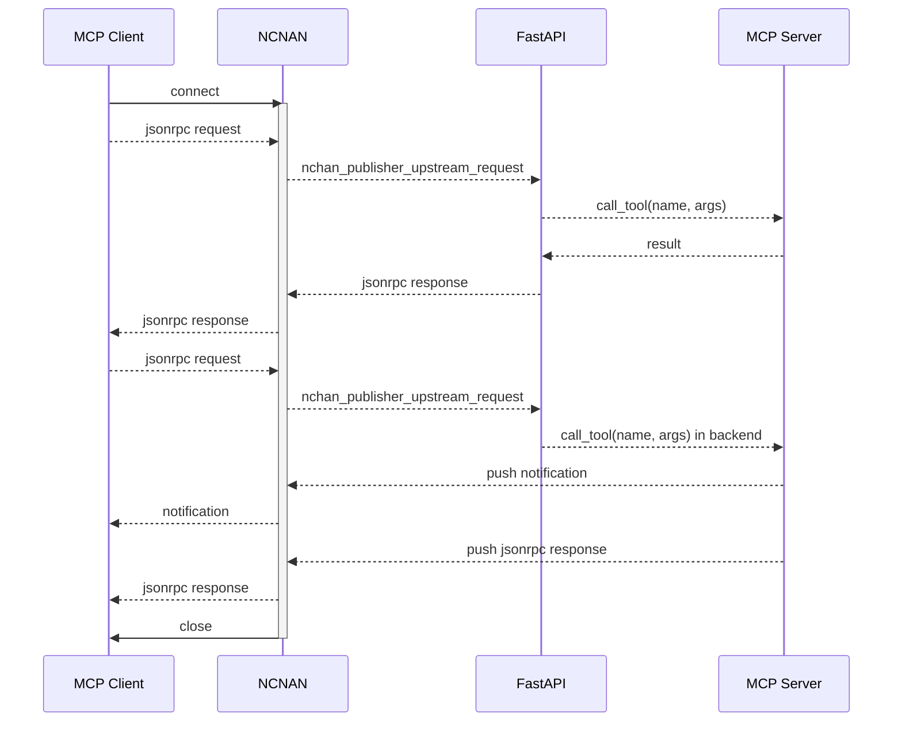

# Nchan MCP Transport

A high-performance MCP (Model Control Protocol) transport layer implementation based on Nginx + Nchan, supporting both WebSocket and Server-Sent Events (SSE) to provide a reliable communication channel for AI models.

## Project Overview

Nchan-MCP-Transport is a middleware service that not only provides a high-performance MCP transport layer—with support for WebSocket and Server-Sent Events for reliable AI model communication—but also functions as a gateway for request routing and protocol adaptation. Additionally, this project includes the Python library httmcp (HyperText Transfer Model Control Protocol) to simplify the development and integration of MCP tools.

## Features

- **Dual Protocol Support**: Supports both WebSocket and SSE transport modes.
- **High Performance**: Leverages Nginx + Nchan for an efficient publish/subscribe messaging system.
- **MCP Protocol Implementation**: Fully compliant with the MCP protocol specifications.
- **Easy Integration**: Provides a simple API design via the FastAPI framework.
- **Session Management**: Automatically handles MCP session creation and maintenance.
- **Tooling System**: Supports definition and invocation of MCP tools.
- **Resource Management**: Comes with built-in resource management capabilities.
- **OpenAPI Integration**: Automatically converts OpenAPI specifications into MCP services.

## Advantages

1. **Performance**: Uses Nginx and Nchan to efficiently handle long-lived connections, outperforming pure Python implementations.
2. **Scalability**: Leverages Nginx’s capability to manage a large number of concurrent connections.
3. **Easy Deployment**: Packaged with Docker for straightforward deployment and horizontal scaling.
4. **Protocol Adaptability**: Automatically detects and adapts to the optimal connection mode (WebSocket/SSE).
5. **Reliability**: Ensures robust messaging with Nchan's caching and delivery mechanism.
6. **Extensibility**: Easily integrate third-party services via OpenAPI specifications.

## Limitations

1. **Nginx Dependency**: Requires Nginx with the Nchan module.
2. **Configuration Complexity**: Demands accurate configuration for both Nginx and the application.
3. **Debugging Difficulty**: Distributed system challenges may complicate troubleshooting.

## Architecture

- **Frontend Proxy**: Nginx + Nchan module  
- **Backend Service**: FastAPI + HTTMCP  
- **Containerization**: Docker  
- **Communication Protocol**: MCP (Model Control Protocol)

## Sequence Diagram

1. session_id (identical to nchan_channel_id) remains valid from connection creation to termination.
2. Fast responses for short tasks.
3. Asynchronous queue processing for long tasks with progress notifications and final results.



## Quick Start

Install dependencies locally via pip:
```bash
pip install httmcp
```

### Deployment

1. Clone the project:

```bash
git clone https://github.com/yourusername/nchan-mcp-transport.git
cd nchan-mcp-transport
```

2. Start the service:

```bash
docker-compose up -d
```

### Usage

#### Creating an MCP Server
```python
server = HTTMCP(
    "httmcp",
    publish_server="http://nchan:80",
)
```

#### Defining Custom Tools

In `app/app.py`, add your custom tool using a decorator:

```python
@server.tool()
async def your_tool_name(param1: type, param2: type) -> return_type:
    # Your tool logic here
    return result
```

#### Defining Custom Resources
```python
@server.resource("resource://my-resource")
def get_data() -> str:
    return "Hello, world!"
```

#### Running the Server

```python
app = FastAPI()

# Supports multiple MCP servers on one FastAPI instance
app.include_router(server.router)

if __name__ == "__main__":
    import uvicorn
    uvicorn.run(app, host="0.0.0.0", port=8000)
```

#### OpenAPIMCP Integration

Leverage OpenAPI to automatically create MCP tools:

```python
async def create_openapi_mcp_server():
    url = "https://example.com/api-spec.json"  # OpenAPI spec URL
    openapi_server = await OpenAPIMCP.from_openapi(url, publish_server="http://nchan:80")
    app.include_router(openapi_server.router)

asyncio.run(create_openapi_mcp_server())
```

This will convert all operations defined in the OpenAPI spec into MCP tools.

## Server Configuration

Detailed Nginx configuration is in the `docker/nchan.conf` file and includes:

1. Entry route: `/mcp/{server_name}`  
2. Channel configuration: `/mcp/{server_name}/{channel_id}`  
3. Internal processing: `/internal/mcp-process`

## Contribution Guidelines

Contributions via issues and pull requests are welcome!