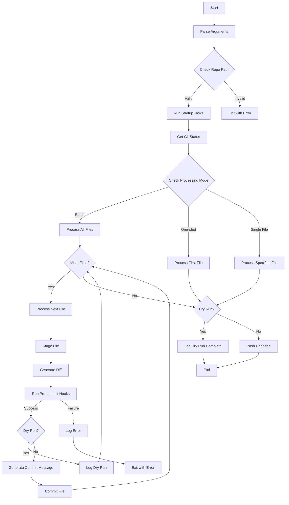

# push

The `push` command is part of the `klingon_tools` pip library. It automates git operations such as staging, committing, and pushing files. The script integrates with pre-commit hooks and uses OpenAI's API to generate commit messages, making rapid iterative development structured, consistent, and easy to manage.

## Features

- **Automated Commit Message Generation**: Generate commit messages based on the changes made using the OpenAI API.
- **Pre-commit Hooks Integration**: Run pre-commit hooks to ensure code quality and consistency.
- **Multiple Processing Modes**:
  - Batch mode: Process all untracked and modified files.
  - One-shot mode: Process and commit only one file and then exit.
  - Single file mode: Process a specific file.
- **Dry-run Mode**: Run the script without committing or pushing changes.
- **Debug Mode**: Enable verbose logging for troubleshooting.

## Installation

Install the `klingon_tools` library using pip:

```sh
pip install klingon_tools
```

## Usage

Run the `push` command from the root of your repository:

```sh
push [OPTIONS]
```

### Command-Line Arguments

The following command-line arguments are supported:

- `--repo-path <path>`: Path to the git repository (default: current directory).
- `--debug`: Enable debug mode for more verbose logging.
- `--file-name <file>`: Specify a single file to process.
- `--oneshot`: Process and commit only one file then exit.
- `--dryrun`: Run the script without committing or pushing changes.
- `-h`, `--help`: Show help message and exit.

### Example Usage

1. Process all untracked and modified files in batch mode:

```sh
push
```

2. Process and commit only one file:

```sh
push --oneshot
```

3. Run the script without committing or pushing changes:

```sh
push --dryrun
```

4. Process a specific file:

```sh
push --file-name example.txt
```

### Expected Output

The script provides detailed output for each step of the process. Here's an example of what you might see:

```plaintext
Checking for software requirements...                                        ✅
Using git user name:...                                            John Doe
Using git user email:...                                       john.doe@example.com
--------------------------------------------------------------------------------
Deleted files...                                                              0
Untracked files...                                                            2
Modified files...                                                             1
Staged files...                                                               0
Committed not pushed files...                                                 0
--------------------------------------------------------------------------------
Batch mode enabled...                                                        📦
Un-staging all staged files...                                               🔁
Processing file...                                      klingon_tools/README.md
Staging file...                                                              ✅
Diff generated...                                                            ✅
--------------------------------------------------------------------------------
Generated commit message:

✨ feat(klingon_tools): Update README.md with additional utilities and descriptions

- Updated descriptions and formatting for LogTools features.
- Added new utilities like push and gh-actions-update with descriptions.
- Included installation instructions and class/method details for better understanding of LogTools.
- Expanded on the usage examples of `log_message`, `method_state`, and `command_state`.
- Documented the new `push` command with its arguments and example usage for a structured development process.
- Provided information on contributing to the project and welcoming new ideas.

Signed-off-by: John Doe <john.doe@example.com>

--------------------------------------------------------------------------------
Pre-commit completed...                                                      ✅
File committed...                                                            ✅
Pushed changes to remote repository...                                       ✅
All files processed. Script completed successfully....                       🚀
================================================================================
```

## Detailed Workflow

The `push` command follows a complex workflow with multiple decision points based on the provided options. Here's a detailed Mermaid diagram illustrating the process:



### Workflow Description

1. **Start**: The script begins execution.

2. **Parse Arguments**: Command-line arguments are parsed to determine the mode of operation and other settings.

3. **Check Repo Path**: Validates the provided or default repository path.

4. **Run Startup Tasks**: Performs initial setup, including logging configuration and software requirement checks.

5. **Get Git Status**: Retrieves the current status of the git repository, identifying modified, untracked, and deleted files.

6. **Check Processing Mode**: Determines whether to run in batch mode, one-shot mode, or single file mode based on the provided arguments.

7. **Process Files**: Depending on the mode, the script will:
   - Batch Mode: Process all untracked and modified files.
   - One-shot Mode: Process only the first untracked or modified file.
   - Single File Mode: Process only the specified file.

8. **File Processing Loop**:
   - Stage File: Adds the file to the git staging area.
   - Generate Diff: Creates a diff of the changes for commit message generation.
   - Run Pre-commit Hooks: Executes any configured pre-commit hooks.
   - If hooks pass and not in dry-run mode:
     - Generate Commit Message: Uses OpenAI API to create a commit message based on the diff.
     - Commit File: Commits the file with the generated message.
   - If in dry-run mode, logs the actions without making changes.
   - Repeats for each file in batch mode.

9. **Push Changes**: If not in dry-run mode and there are committed changes, pushes to the remote repository.

10. **End**: Script execution completes.

Throughout the process, the script provides detailed logging of each step, allowing users to track the progress and identify any issues that may arise.

## Environmental Requirements

The `push` command requires an OpenAI API key to generate commit messages. Set the `OPENAI_API_KEY` environment variable with your OpenAI API key:

```sh
export OPENAI_API_KEY=your_openai_api_key
```

## Dependencies

- Git
- OpenAI API (for commit message generation)
- pre-commit

## Error Handling

The script will exit with a non-zero status code if:
- The git repository fails to initialize
- Pre-commit hooks fail

## Contributing

Contributions are welcome. Please open an issue to discuss your idea before making a change.

## License

[MIT](https://choosealicense.com/licenses/mit/)
