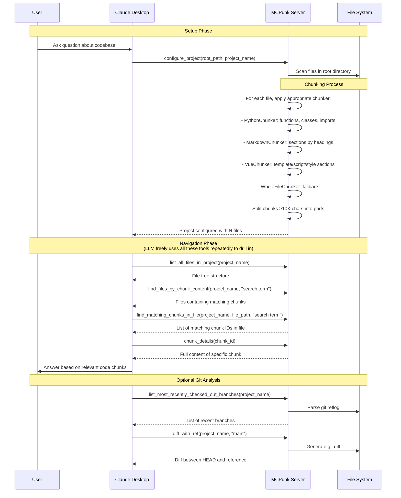

# [MCPunk 🤖](https://github.com/jurasofish/mcpunk)

**Chat with your codebase without embeddings by giving the LLM tools to search your code intelligently.**

MCPunk lets you explore and understand codebases through conversation. It works by:

1. Breaking files into logical chunks (functions, classes, markdown sections)
2. Giving the LLM tools to search and query these chunks
3. Letting the LLM find the specific code it needs to answer your questions

No embeddings, no complex configuration - just clear, auditable searching that you can see and guide.
It works great with Claude Desktop, or any other [MCP](https://github.com/modelcontextprotocol) client.

<a href="https://glama.ai/mcp/servers/3j9kxuocc6">
  
</a>

[GitHub Repository](https://github.com/jurasofish/mcpunk)

Built with the following in mind

- **Context is King** - LLMs can be great but only if provided with appropriate context.
- **Context is Precious** - LLMs need context, but they can't handle too much.
  A travesty! MCPunk is RAG that inherently provides the LLM contextual
  hints, allowing the LLM to really narrow in on only the relevant content.
- **Human in the Loop** - **You** can see exactly what data the LLM has considered
  and how it found it, **You** can jump into chat and direct things wherever you want.

# Setup

_These are instructions for Claude Desktop, but MCPunk can be used anywhere MCP is used._

1. **[Install uv](https://docs.astral.sh/uv/getting-started/installation/)**
1. **Put the snippet below in your `claude_desktop_config.json`**
   ([Details about `claude_desktop_config.json` including location](https://glama.ai/blog/2024-11-25-model-context-protocol-quickstart#testing-mcp-using-claude-desktop))
1. **Restart Claude Desktop** and you should see the tools available after a small
   delay, like the screengrab below
1. **Chat away**: "hey pal can you set up the ~/git/mcpunk project and tell me how python files are chunked"

(_`"command": "uvx",` might not work, and you may need to use e.g. `"command": "/Users/michael/.local/bin/uvx",`_)

```json
{
  "mcpServers": {
    "MCPunk": {
      "command": "uvx",
      "args": ["mcpunk"]
    }
  }
}
```


# Usage Examples

### Answer Questions About Your Codebase

- **[User]** Hey pal can you please set up the ~/git/mcpunk repo, then help me
  understand how a user of mcpunk would get the git diff of the currently
  checked out branch in the repo that they have configured with mcpunk
- **[Claude]** Call `configure_project`
- **[Claude]** Call `list_all_files_in_project`
- **[Claude]** Call `find_files_by_chunk_content`
- **[Claude]** ... makes a total of 21 tool calls with MCPunk.
- **[Claude]** Now I understand how the git diff functionality works in mcpunk.
  Let me summarize how a user would get the git diff of the currently checked out branch:
  To get a git diff of the currently checked out branch in a repo configured with mcpunk:
  1. First, the user needs to configure mcpunk to work with their project by using the configure_project tool
  2. To see what branches were recently checked out (to identify what to diff against)
  3. Then, to get the diff between the current branch (HEAD) and a reference branch
  This will display the differences between the current branch (HEAD) and the specified reference branch.
  The ref parameter should be the name of the base branch (like "main" or "develop") that you want to compare against.
- **[User]** Great job pal!

### PR Review

- **[user]** Hey pal can you please set up the ~/git/mcpunk repo and have a
  look at the current branch versus `scratch/1.5`
- **[Claude]** Sets up ~/git/mcpunk and calls `diff_with_ref` for ref `scratch/1.5`
- **[Claude]** I see you've made several changes, primarily adding a new test
  file `tests/test_git_analysis.py`...
- **[user]** how does this fit into the rest of the codebase?
- **[Claude]** Makes 5 tool calls for listing files by chunks, listing chunks,
  fetching chunk details
- **[Claude]** I see - the code parses git reflog output to track recently
  checked out branches. The main function get_recent_branches takes a repo path
  and returns the last N branches that were checked out, using _branches_from_reflog
  as a helper to parse the raw reflog output.
- **[User]** If you were in a rush and had to direct someone to review this work,
  what would you direct them to look at? Please outline discrete pieces of work
- **[Claude]**
  - The `split("to ")[-1]` in _branches_from_reflog looks fragile
  - Test data only shows simple branch names, what about spaces/special chars?
  - Is example_reflog representative of real git reflog output?
  - Are we testing against actual git behavior?
- **[User]** You're the best!

### Work across multiple codebases

You can just ask your LLM to set up multiple projects, and it can freely query
across them. Handy if one depends on the other, and they're in different repos.
In this case the LLM should recognise this via imports.

# What is MCPunk & Other Background

MCPunk is an MCP server that provides tools to

- Configure a project, which is a directory of files. When configured, the files
  will be split into logical chunks. MCPunk is built for code, but really
  it could be applied to any documents, even images if you want to.
- Search for files in a project containing specific text
- Search for chunks in a file containing specific text
- View the full contents of a specific chunk

Along with this, it provides a few chunkers built in. The most mature is the
Python chunker.

MCPunk doesn't have to be used for conversation. It can be used as part of code
review in a CI pipeline, for example. It's really general RAG.



### Roaming RAG Crash Course

See

- https://arcturus-labs.com/blog/2024/11/21/roaming-rag--make-_the-model_-find-the-answers/
- https://simonwillison.net/2024/Dec/6/roaming-rag/

The gist of roaming RAG is

1. Break down content (a codebase, pdf files, whatever) into "chunks".
   Each chunk is a "small" logical item like a function, a section in
   a markdown document, or all imports in a code file.
2. Provide the LLM tools to search chunks. MCPunk does this by providing tools
   to search for files containing chunks with specific text, and to list the
   full contents of a specific chunk.

Compared to more traditional "vector search" RAG:

- The LLM has to drill down to find chunks, and naturally is aware of their
  broader context (like what file they're in)
- Chunks should always be coherent. Like a full function.
- You can see exactly what the LLM is searching for, and it's generally
  obvious if it's searching poorly and you can help it out by suggesting
  improved search terms.
- Requires exact search matching. MCPunk is NOT providing fuzzy search of any kind.

### Chunks

A chunk is a subsection of a file. For example,

- A single python function
- A markdown section
- All the imports from a Python file

Chunks are created from a file by [chunkers](mcpunk/file_chunkers.py),
and MCPunk comes with a handful built in.

When a project is set up in MCPunk, it goes through all files and applies
the first applicable chunker to it. The LLM can then use tools to (1) query for files
containing chunks with specific text in them, (2) query all chunks in a specific
file, and (3) fetch the full contents of a chunk.

This basic foundation enables claude to effectively navigate relatively large
codebases by starting with a broad search for relevant files and narrowing in
on relevant areas.

Built-in chunkers:

- `PythonChunker` chunks things into classes, functions, file-level imports,
  and file-level statements (e.g. globals). Applicable to files ending in `.py`
- `VueChunker` chunks into 'template', 'script', 'style' chunks - or whatever
  top-level `<blah>....</blah>` items exist. Applicable to files ending in `.vue`
- `MarkdownChunker` chunks things into markdown sections (by heading).
  Applicable to files ending in `.md`
- `WholeFileChunker` fallback chunker that creates a single chunk for the entire file.
  Applicable to any file.

Any chunk over 10k characters long (configurable) is automatically split into
multiple chunks, with names suffixed with `part1`, `part2`, etc. This helps
avoid blowing out context while still allowing reasonable navigation of chunks.

### Custom Chunkers

Each type of file (e.g. Python vs C) needs a custom chunker.
MCPunk comes with some [built in](mcpunk/file_chunkers.py).
If no specific chunker matches a file, a default chunker that just slaps
the whole file into one chunk is used.

The current suggested way to add chunks is to fork this project and add them,
and run MCPunk per [Development](#development).
To add a chunker

- Add it in [file_chunkers.py](mcpunk/file_chunkers.py), inheriting from `BaseChunker`
- Add it to `ALL_CHUNKERS` in [file_breakdown.py](mcpunk/file_breakdown.py)

It would be possible to implement some kind of plugin system for modules
to advertise that they have custom chunkers for MCPunk to use, like pytest's
plugin system, but there are currently no plans to implement this (unless
someone wants to do it).

# Limitations

- Sometimes LLM is poor at searching. e.g. search for "dependency", missing
  terms "dependencies". Room to stem things.
- Sometimes LLM will try to find a specific piece of critical code but fail to
  find it, then continue without acknowledging it has limited contextual awareness.
- "Large" projects are not well tested. A project with ~1000 Python files containing
  in total ~250k LoC works well. Takes ~5s to setup the project. As codebase
  size increases, time to perform initial chunking will increase, and likely
  more sophisticated searching will be required. The code is generally not
  written with massive codebases in mind - you will see things like all data
  stored in memory, searching done by iterating over all data, various
  things that are screaming out for basic optimisation.
- Small projects are probably better off with all the code concatenated and
  thrown into context. MCPunk is really only appropriate where this is impractical.
- In some cases it would obviously be better to allow the LLM to grab an entire
  file rather than have it pick out chunks one at a time. MCPunk has no mechanism
  for this. In practice, I have not found this to be a big issue.

# Configuration

Various things can be configured via environment variables prefixed with `MCPUNK_`.
For available options, see [settings.py](mcpunk/settings.py) - these are loaded
from env vars via [Pydantic Settings](https://github.com/pydantic/pydantic-settings).

For example, to configure the `include_chars_in_response` option:

```json
{
  "mcpServers": {
    "MCPunk": {
      "command": "uvx",
      "args": ["mcpunk"],
      "env": {
        "MCPUNK_INCLUDE_CHARS_IN_RESPONSE": "false"
      }
    }
  }
}
```

# Roadmap & State of Development

MCPunk is considered near feature complete.
It has not had broad use, and as a user it is likely you will run into bugs or
rough edges. Bug reports welcomed at https://github.com/jurasofish/mcpunk/issues

**Roadmap Ideas**

- Add a bunch of prompts to help with using MCPunk. Without real "explain how to make
  a pancake to an alien"-type prompts things do fall a little flat.
- Include module-level comments when extracting python module-level statements.
- Possibly stemming for search
- Change the whole "project" concept to not need files to actually exist - this
  leads to allowing "virtual" files inside the project.
  - Consider changing files from having a path to having a URI, so coule be like
    `file://...` / `http[s]://` / `gitdiff://` / etc arbitrary URIs
- Chunking of git diffs. Currently, there's a tool to fetch an entire diff. This
  might be very large. Instead, the tool could be changed to `add_diff_to_project`
  and it puts files under the `gitdiff://` URI or under some fake path
- Caching of a project, so it doesn't need to re-parse all files every time you
  restart MCP client. This may be tricky as changes to the code in a chunker
  will make cache invalid. Likely not to be prioritised, since it's not that
  slow for my use cases.
- Ability for users to provide custom code to perform chunking, perhaps
  similar to [pytest plugins](https://docs.pytest.org/en/stable/how-to/writing_plugins.html#making-your-plugin-installable-by-others)
- Something like tree sitter could possibly be used for a more generic chunker
- Tracking of characters sent/received, ideally by chat.
- State, logging, etc by chat

# Development

see [run_mcp_server.py](mcpunk/run_mcp_server.py).

If you set up claude desktop like below then you can restart it to see latest
changes as you work on MCPunk from your local version of the repo.

```json
{
  "mcpServers": {
    "MCPunk": {
      "command": "/Users/michael/.local/bin/uvx",
      "args": [
        "--from",
        "/Users/michael/git/mcpunk",
        "--no-cache",
        "mcpunk"
      ]
    }
  }
}
```

#### Testing, Linting, CI

See the [Makefile](Makefile) and github actions workflows.
