# 🌍 memories-dev

<div align="center">

**Building Earth's Unified Memory System for Artificial General Intelligence**

[](LICENSE)
[](https://www.python.org/downloads/)
[](https://github.com/psf/black)
[](https://pypi.org/project/memories-dev/)
[](https://pypi.org/project/memories-dev/)
[](https://github.com/Vortx-AI/memories-dev/releases/tag/v2.0.7)
[](https://discord.gg/tGCVySkX4d)

<a href="https://www.producthunt.com/posts/memories-dev?embed=true&utm_source=badge-featured&utm_medium=badge&utm_souce=badge-memories&#0045;dev" target="_blank"></a>

</div>

<div align="center">
  <h3>The Scientific Framework for Grounding AI Systems in Earth Observation</h3>
  <p><i>"From Data to Memory: Bridging Artificial Intelligence with Earth's Observable Reality"</i></p>
</div>

<hr>

<div align="center">
  
</div>

## 📊 Scientific Abstract

**memories-dev** represents a paradigm shift in grounding artificial intelligence systems through Earth observation data. Current foundation models suffer from hallucinations and limited temporal understanding of real-world physical environments. This framework implements a multi-tiered memory architecture that integrates real-time satellite imagery, geospatial vectors, sensor networks, and environmental metrics to create a comprehensive memory system of Earth's observable state.

Our approach demonstrates significant improvements in AI factuality when reasoning about geographic environments:
- **Reduced hallucinations** when describing physical locations compared to standard LLMs
- **Enhanced spatiotemporal reasoning** for understanding how environments change over time
- **Improved precision** in environmental assessments and geospatial analysis

These capabilities are achieved through our novel memory management system utilizing specialized Earth analyzers and a hierarchical approach to data acquisition, processing, and retrieval, all designed with scientific rigor and validation protocols.

## 📝 Table of Contents

- [Scientific Foundation](#-scientific-foundation)
- [Core Architecture](#-core-architecture)
- [Memory System Design](#-memory-system-design)
- [Earth Analyzers](#-earth-analyzers)
- [AI Integration](#-ai-integration) 
- [Deployment Architecture](#-deployment-architecture)
- [Benchmarks](#-benchmarks)
- [Installation](#-installation)
- [Usage Examples](#-usage-examples)
- [Citations](#-citations)
- [Contributing](#-contributing)
- [License](#-license)

## 🔬 Scientific Foundation

### Research Problem

Current AI systems face fundamental challenges when reasoning about the physical world:

1. **Hallucination Generation**: Foundation models trained on internet text produce plausible but factually incorrect assertions about physical environments
2. **Temporal Discontinuity**: Inability to track and reason about environmental changes over time
3. **Multimodal Integration Gaps**: Difficulty merging visual, spatial, and environmental data into coherent reasoning
4. **Ground Truth Verification**: Lack of objective verification mechanisms for assertions about physical reality

### Methodological Approach

memories-dev addresses these challenges through:


### Key Scientific Innovations

1. **Multi-Tiered Memory Architecture**: Hierarchical organization of Earth observation data across hot, warm, cold, and glacier tiers based on access patterns and query relevance
   
2. **Asynchronous Earth Analyzers**: Specialized processing modules that extract contextual understanding from raw observation data in parallel
   
3. **Temporal Memory Chains**: Algorithms for linking observations across time to enable reasoning about environmental changes
   
4. **Spatiotemporal Query Engine**: Advanced retrieval system that handles complex queries with both location and time components
   
5. **Multi-Modal Data Fusion**: Techniques for combining satellite imagery, vector data, and tabular information into unified memory representations

### Foundation Models + Earth Memory Integration

```mermaid
%%{init: {'theme': 'forest', 'themeVariables': { 'primaryColor': '#1f77b4', 'primaryTextColor': '#fff', 'primaryBorderColor': '#0d6efd', 'lineColor': '#3498db', 'secondaryColor': '#16a085', 'tertiaryColor': '#2980b9'}}}%%
graph TD
    classDef foundationModels fill:#3498db,stroke:#2980b9,stroke-width:2px,color:white,font-weight:bold
    classDef earthMemory fill:#16a085,stroke:#1abc9c,stroke-width:2px,color:white,font-weight:bold
    classDef contextNodes fill:#9b59b6,stroke:#8e44ad,stroke-width:2px,color:white
    classDef intelligenceNodes fill:#f39c12,stroke:#f1c40f,stroke-width:2px,color:white
    classDef memoryNode fill:#e74c3c,stroke:#c0392b,stroke-width:2px,color:white,font-weight:bold
    classDef appNode fill:#2c3e50,stroke:#34495e,stroke-width:2px,color:white,font-weight:bold
    
    A[🤖 Foundation Models] -->|Augmented with| B[🌍 Earth Memory]
    B -->|Provides| C[📍 Spatial Context]
    B -->|Provides| D[⏱️ Temporal Context]
    B -->|Provides| E[🌱 Environmental Context]
    C -->|Enables| F[📌 Location-Aware Intelligence]
    D -->|Enables| G[⏰ Time-Aware Intelligence]
    E -->|Enables| H[🌿 Environment-Aware Intelligence]
    F --> I[🧠 Collective AGI Memory]
    G --> I
    H --> I
    I -->|Powers| J[🚀 Next-Gen AI Applications]
    
    A:::foundationModels
    B:::earthMemory
    C:::contextNodes
    D:::contextNodes
    E:::contextNodes
    F:::intelligenceNodes
    G:::intelligenceNodes
    H:::intelligenceNodes
    I:::memoryNode
    J:::appNode

    linkStyle 0 stroke:#3498db,stroke-width:2px,stroke-dasharray: 5 5
    linkStyle 1,2,3 stroke:#16a085,stroke-width:2px
    linkStyle 4,5,6 stroke:#9b59b6,stroke-width:2px
```



## 🏗️ Core Architecture

The system architecture implements a scientific approach to memory management:


### Data Processing Workflow

The scientific processing pipeline ensures data integrity and accessibility:

```mermaid
%%{init: {'theme': 'dark', 'themeVariables': { 'primaryColor': '#1e293b', 'primaryTextColor': '#ffffff', 'primaryBorderColor': '#334155', 'lineColor': '#60a5fa', 'secondaryColor': '#10b981', 'tertiaryColor': '#3b82f6'}}}%%
sequenceDiagram
    participant Client as 📱 Client Application
    participant MM as 🧠 Memory Manager
    participant DA as 🛰️ Data Acquisition
    participant MS as 💾 Memory Store
    participant EA as 🔍 Earth Analyzers
    participant AI as 🤖 AI Models
    
    Client->>MM: Request Analysis
    activate MM
    Note over MM: Orchestrates the entire workflow<br/>with parallel processing
    
    par Data Collection Phase
        MM->>DA: Fetch Earth Data
        activate DA
        Note over DA: Multi-source acquisition with<br/>priority-based scheduling
        DA-->>MM: Return Raw Data
        deactivate DA
    and Memory Check Phase
        MM->>MS: Query Existing Memories
        activate MS
        Note over MS: Intelligent caching with<br/>tiered storage strategy
        MS-->>MM: Return Cached Results
        deactivate MS
    end
    
    MM->>EA: Process Earth Data
    activate EA
    Note over EA: 15+ specialized analyzers<br/>running asynchronously
    
    par Parallel Analysis
        EA->>EA: Terrain Analysis
        EA->>EA: Climate Analysis
        EA->>EA: Environmental Impact
        EA->>EA: Urban Development
    end
    
    EA-->>MM: Return Analysis Results
    deactivate EA
    
    MM->>AI: Enhance with AI Models
    activate AI
    Note over AI: Multiple model integration<br/>with Earth-grounding
    AI-->>MM: Return Enhanced Results
    deactivate AI
    
    MM->>MS: Store Results
    activate MS
    Note over MS: Multi-tier storage based on<br/>access patterns & importance
    MS-->>MM: Confirm Storage Complete
    deactivate MS
    
    MM-->>Client: Return Comprehensive Analysis
    deactivate MM
    
    Note over Client,AI: Complete data lifecycle with<br/>adaptive memory management
```



### Advanced Data Flow Architecture

The memories-dev framework implements a sophisticated data flow architecture that transforms raw Earth observation data into actionable intelligence through a series of optimized processing stages:


#### Key Differential Features

| Processing Stage | Capabilities | Benefits |
|-----------------|--------------|----------|
| **Data Ingestion** | Multi-source acquisition, format normalization, quality filtering | Comprehensive data coverage with quality guarantees |
| **Processing Engine** | Parallel processing, feature extraction, temporal/spatial alignment | Efficient handling of heterogeneous Earth data |
| **Memory System** | Tiered storage, adaptive caching, compression, encryption | Optimized performance with cost-efficiency |
| **Earth Intelligence** | 15+ specialized analyzers, multi-dimensional scoring | Advanced insights across physical environment domains |
| **Insight Delivery** | Model integration, API exposure, visualization | Actionable intelligence for applications |

This advanced architecture enables memories-dev to process terabytes of Earth observation data with exceptional efficiency, transforming raw data into structured memory that grounds AI systems in physical reality.

## 💾 Memory System Design

Our memory system implements a scientifically-validated approach to data organization:


### Memory Tier Specifications

| Memory Tier | Access Time | Storage Medium | Use Case | Data Types |
|-------------|-------------|----------------|----------|------------|
| Hot Memory | <10ms | RAM-based vector store | Current session data, active location analysis | Embeddings, recent queries, active location context |
| Warm Memory | <100ms | SSD-based database | Recent locations, frequently accessed regions | Recent satellite imagery, vector data for common areas |
| Cold Memory | <1s | Object storage | Historical analysis, less frequent locations | Historical imagery, environmental data series |
| Glacier | <60s | Archive storage | Long-term change detection, baseline data | Baseline measurements, long-term environmental data |

## 🔍 Earth Analyzers

Our specialized Earth analyzers extract scientific insights from raw observation data:

```mermaid
%%{init: {'theme': 'forest', 'themeVariables': { 'primaryColor': '#2c3e50', 'primaryTextColor': '#ecf0f1', 'primaryBorderColor': '#34495e', 'lineColor': '#3498db', 'secondaryColor': '#16a085', 'tertiaryColor': '#2980b9'}}}%%
graph TD
    classDef mainSystem fill:#1e293b,stroke:#334155,stroke-width:2px,color:white,font-weight:bold
    classDef terrainAnalyzer fill:#3b82f6,stroke:#2563eb,stroke-width:2px,color:white,font-weight:bold
    classDef climateAnalyzer fill:#ef4444,stroke:#dc2626,stroke-width:2px,color:white,font-weight:bold
    classDef environmentalAnalyzer fill:#10b981,stroke:#059669,stroke-width:2px,color:white,font-weight:bold
    classDef landAnalyzer fill:#8b5cf6,stroke:#7c3aed,stroke-width:2px,color:white,font-weight:bold
    classDef waterAnalyzer fill:#0ea5e9,stroke:#0284c7,stroke-width:2px,color:white,font-weight:bold
    classDef geologicalAnalyzer fill:#f59e0b,stroke:#d97706,stroke-width:2px,color:white,font-weight:bold
    classDef urbanAnalyzer fill:#6366f1,stroke:#4f46e5,stroke-width:2px,color:white,font-weight:bold
    classDef bioAnalyzer fill:#84cc16,stroke:#65a30d,stroke-width:2px,color:white,font-weight:bold
    classDef airAnalyzer fill:#06b6d4,stroke:#0891b2,stroke-width:2px,color:white,font-weight:bold
    classDef noiseAnalyzer fill:#ec4899,stroke:#db2777,stroke-width:2px,color:white,font-weight:bold
    classDef solarAnalyzer fill:#eab308,stroke:#ca8a04,stroke-width:2px,color:white,font-weight:bold
    classDef walkAnalyzer fill:#14b8a6,stroke:#0d9488,stroke-width:2px,color:white,font-weight:bold
    classDef viewAnalyzer fill:#8b5cf6,stroke:#7c3aed,stroke-width:2px,color:white,font-weight:bold
    classDef microAnalyzer fill:#22c55e,stroke:#16a34a,stroke-width:2px,color:white,font-weight:bold
    classDef propertyAnalyzer fill:#f43f5e,stroke:#e11d48,stroke-width:2px,color:white,font-weight:bold
    classDef infraAnalyzer fill:#6366f1,stroke:#4f46e5,stroke-width:2px,color:white,font-weight:bold
    classDef subAnalyzer fill:#64748b,stroke:#475569,stroke-width:1px,color:white
    
    A[🧠 Earth Memory Analyzers] --> B[🏔️ TerrainAnalyzer]
    A --> C[🌡️ ClimateDataFetcher]
    A --> D[🌱 EnvironmentalImpactAnalyzer]
    A --> E[🏞️ LandUseClassifier]
    A --> F[💧 WaterResourceAnalyzer]
    A --> G[🪨 GeologicalDataFetcher]
    A --> H[🏙️ UrbanDevelopmentAnalyzer]
    A --> I[🦋 BiodiversityAnalyzer]
    A --> J[💨 AirQualityMonitor]
    A --> K[🔊 NoiseAnalyzer]
    A --> L[☀️ SolarPotentialCalculator]
    A --> M[🚶 WalkabilityAnalyzer]
    A --> N[👁️ ViewshedAnalyzer]
    A --> O[🌤️ MicroclimateAnalyzer]
    A --> P[💰 PropertyValuePredictor]
    A --> Q[🛣️ InfrastructureAnalyzer]
    
    B --> B1[Elevation Analysis]
    B --> B2[Slope Calculation]
    B --> B3[Aspect Determination]
    B --> B4[Landslide Risk Assessment]
    
    C --> C1[Temperature Trend Analysis]
    C --> C2[Precipitation Pattern Recognition]
    C --> C3[Climate Change Projection]
    C --> C4[Extreme Weather Risk Modeling]
    
    F --> F1[Flood Risk Assessment]
    F --> F2[Water Quality Analysis]
    F --> F3[Drought Risk Modeling]
    F --> F4[Watershed Analysis]
    
    H --> H1[Urban Growth Pattern Analysis]
    H --> H2[Development Plan Extraction]
    H --> H3[Infrastructure Network Mapping]
    H --> H4[Zoning Change Detection]
    
    A:::mainSystem
    B:::terrainAnalyzer
    C:::climateAnalyzer
    D:::environmentalAnalyzer
    E:::landAnalyzer
    F:::waterAnalyzer
    G:::geologicalAnalyzer
    H:::urbanAnalyzer
    I:::bioAnalyzer
    J:::airAnalyzer
    K:::noiseAnalyzer
    L:::solarAnalyzer
    M:::walkAnalyzer
    N:::viewAnalyzer
    O:::microAnalyzer
    P:::propertyAnalyzer
    Q:::infraAnalyzer
    
    B1:::subAnalyzer
    B2:::subAnalyzer
    B3:::subAnalyzer
    B4:::subAnalyzer
    C1:::subAnalyzer
    C2:::subAnalyzer
    C3:::subAnalyzer
    C4:::subAnalyzer
    F1:::subAnalyzer
    F2:::subAnalyzer
    F3:::subAnalyzer
    F4:::subAnalyzer
    H1:::subAnalyzer
    H2:::subAnalyzer
    H3:::subAnalyzer
    H4:::subAnalyzer
```



### Scientific Methodologies

Each analyzer implements validated scientific methodologies:

| Analyzer | Scientific Method | Data Sources | Validation Approach |
|----------|-------------------|--------------|---------------------|
| TerrainAnalyzer | Digital Elevation Model Analysis | SRTM, ASTER GDEM, LiDAR | Ground truth comparison with surveyed elevations |
| ClimateDataFetcher | Time-series Climatology | CMIP6, ERA5, GLDAS | Cross-validation with meteorological stations |
| WaterResourceAnalyzer | Hydrological Modeling | Sentinel-1/2, Landsat, GRACE | Validation against stream gauges and river monitoring |
| BiodiversityAnalyzer | Ecosystem Assessment | GBIF, iNaturalist, MODIS | Field surveys and expert verification |
| AirQualityMonitor | Atmospheric Science Models | Sentinel-5P, CAMS, AirNow | Correlation with ground station measurements |

## 🤖 AI Integration

The framework seamlessly integrates with leading AI models and platforms:


### Supported AI Models

| Provider | Models | Key Features | Integration Type |
|----------|--------|--------------|------------------|
| OpenAI | GPT-4/3.5 Family | Function calling, streaming, embeddings | API |
| Anthropic | Claude 3 Family | Streaming, vision, long context | API |
| DeepSeek AI | DeepSeek Coder, Chat | Specialized coding capabilities | API & Local |
| Mistral AI | Mistral Medium/Small | Efficient, high-performance | API & Local |
| Cohere | Command/Embed | Advanced embeddings, multilingual | API |
| Meta | Llama 3 Family | Open weights, fine-tuning support | Local |
| Local Models | Quantized & GGUF | Offline operation, customization | Local |

### Multi-Model Architecture

```python
from memories.models.load_model import LoadModel
from memories.models.multi_model import MultiModelInference

# Initialize multiple models for ensemble analysis
models = {
    "openai": LoadModel(model_provider="openai", model_name="gpt-4"),
    "anthropic": LoadModel(model_provider="anthropic", model_name="claude-3-opus"),
    "deepseek": LoadModel(model_provider="deepseek-ai", model_name="deepseek-coder")
}

# Create multi-model inference engine
multi_model = MultiModelInference(models=models)

# Analyze property with Earth memory integration
responses = multi_model.get_responses_with_earth_memory(
    query="Analyze environmental risks for this property",
    location={"lat": 37.7749, "lon": -122.4194},
    earth_memory_analyzers=["terrain", "climate", "water"]
)

# Compare model assessments
for provider, response in responses.items():
    print(f"\n--- {provider.upper()} ASSESSMENT ---")
    print(response["analysis"])
```

## 🚀 Deployment Architecture

memories-dev supports three scientifically-validated deployment architectures:

### 1. Standalone Deployment

Optimized for research environments and single-instance deployments:


### 2. Consensus Deployment

Designed for high-reliability scientific computing environments:


### 3. Swarmed Deployment

For large-scale scientific computing and production environments:


### Cloud Provider Support

| Cloud Provider | Features | Deployment Models | Hardware Support |
|----------------|----------|-------------------|-----------------|
| AWS | Auto-scaling, S3 integration, Lambda functions | All | NVIDIA GPUs, Graviton (ARM) |
| GCP | Kubernetes, TPU support, Cloud Storage | All | NVIDIA GPUs, TPUs |
| Azure | AKS, Container Apps, Blob Storage | All | NVIDIA GPUs, AMD MI |
| On-premises | Custom hardware support, airgapped operation | All | NVIDIA GPUs, AMD MI, Intel GPUs |

## 📊 Benchmarks

memories-dev has been rigorously benchmarked across multiple dimensions:

### Performance Metrics

The framework undergoes continuous performance testing across different deployment architectures:

- **Standalone**: Optimized for research and development environments
- **Consensus**: Designed for high-reliability production deployments
- **Swarmed**: Engineered for high-throughput, large-scale operations

Performance testing focuses on key metrics including query latency, memory throughput, data ingestion rates, and concurrent user capacity. Full benchmark reports are available in the [documentation](docs/benchmarks.md).

### Analysis Accuracy

Our Earth analyzers are validated against scientific ground truth data:

- **Terrain Analysis**: Validation against surveyed elevation data and LiDAR measurements
- **Climate Prediction**: Verification with meteorological station records and reanalysis datasets
- **Water Resource Assessment**: Comparison with stream gauge measurements and satellite altimetry
- **Urban Development**: Validation with municipal records and high-resolution satellite imagery
- **Biodiversity Assessment**: Correlation with field surveys and ecological monitoring sites

Detailed methodology and validation reports are available in our [scientific documentation](docs/validation.md).

### Memory System Performance

The multi-tiered memory architecture is designed for optimal performance:

- **Hot Memory**: In-memory vector storage for sub-10ms access to active data
- **Warm Memory**: SSD-based storage for frequently accessed geographic regions
- **Cold Memory**: Object storage for less frequently accessed historical data
- **Glacier**: Archive storage for baseline measurements and long-term storage

Each tier is continuously optimized for access patterns, compression ratios, and storage efficiency.

## 📚 Research & Documentation

### Technical Publications

For researchers interested in the technical foundations of the framework:

- Technical white paper: ["Earth Memory: A Framework for Grounding AI in Observable Reality"](docs/whitepaper.md)
- System architecture: ["Multi-Tiered Memory Systems for Earth Observation Data"](docs/architecture.md)
- Validation methodology: ["Benchmarking Geographic Information Retrieval in AI Systems"](docs/validation.md)

### Related Research Areas

Our work intersects with several active research domains:

1. Geospatial AI and machine learning for Earth observation data
2. Temporally aware memory systems for environmental monitoring
3. Multi-modal information retrieval for scientific applications
4. Grounding mechanisms for large language models
5. Spatial reasoning in artificial intelligence

### Documentation Resources

For comprehensive documentation, visit our [GitHub documentation](docs/), which includes:

- Complete API reference
- Detailed tutorials and examples
- System architecture specifications
- Benchmark methodology and results
- Scientific validation protocols

## 🏗️ Installation

### Standard Installation
```bash
# Basic installation
pip install memories-dev

# With GPU support
pip install memories-dev[gpu]

# Full installation with all features
pip install memories-dev[all]
```

### Development Installation
```bash
# Clone repository
git clone https://github.com/Vortx-AI/memories-dev.git
cd memories-dev

# Install development dependencies
pip install -e ".[dev]"

# Install documentation tools
pip install -e ".[docs]"
```

### Docker Deployment
```bash
# Pull the official Docker image
docker pull vortx/memories-dev:2.0.7

# Run with GPU support
docker run --gpus all -p 8000:8000 -v ./data:/app/data vortx/memories-dev:2.0.7
```

## 📝 Usage Examples

### Setting Up Earth Memory

```python
from memories.earth import OvertureClient, SentinelClient
import os

# Initialize clients
overture_client = OvertureClient(
    api_key=os.getenv("OVERTURE_API_KEY")
)

sentinel_client = SentinelClient(
    username=os.getenv("SENTINEL_USER"),
    password=os.getenv("SENTINEL_PASSWORD")
)

# Configure memory system
from memories import MemoryStore, Config

memory_config = Config(
    storage_path="./earth_memory",
    hot_memory_size=50,  # GB
    warm_memory_size=200,  # GB
    cold_memory_size=1000,  # GB
    vector_store="milvus",
    embedding_model="text-embedding-3-small"
)

memory_store = MemoryStore(memory_config)
```

### Real Estate Analysis

```python
from examples.real_estate_agent import RealEstateAgent
from memories import MemoryStore, Config

# Initialize memory store
config = Config(
    storage_path="./real_estate_data",
    hot_memory_size=50,
    warm_memory_size=200,
    cold_memory_size=1000
)
memory_store = MemoryStore(config)

# Initialize agent with earth memory
agent = RealEstateAgent(
    memory_store,
    enable_earth_memory=True,
    analyzers=["terrain", "climate", "water", "environmental"]
)

# Add property and analyze
property_id = await agent.add_property(property_data)
analysis = await agent.analyze_property_environment(property_id)

print(f"Property added: {property_id}")
print(f"Environmental analysis: {analysis}")
```

### Environmental Monitoring

```python
from memories.analyzers import ChangeDetector
from datetime import datetime, timedelta

# Initialize change detector
detector = ChangeDetector(
    baseline_date=datetime(2020, 1, 1),
    comparison_dates=[
        datetime(2021, 1, 1),
        datetime(2022, 1, 1),
        datetime(2023, 1, 1),
        datetime(2024, 1, 1)
    ]
)

# Detect environmental changes
changes = await detector.analyze_changes(
    location={"lat": 37.7749, "lon": -122.4194, "radius": 5000},
    indicators=["vegetation", "water_bodies", "urban_development"],
    visualization=True
)

# Present findings
detector.visualize_changes(changes)
detector.generate_report(changes, format="pdf")
```

## 🤝 Contributing

We welcome contributions from the scientific community! See [CONTRIBUTING.md](CONTRIBUTING.md) for guidelines.

## 📄 License

This project is licensed under the Apache License 2.0 - see the [LICENSE](LICENSE) file for details.

<p align="center">Built with 💜 by the memories-dev team</p>
