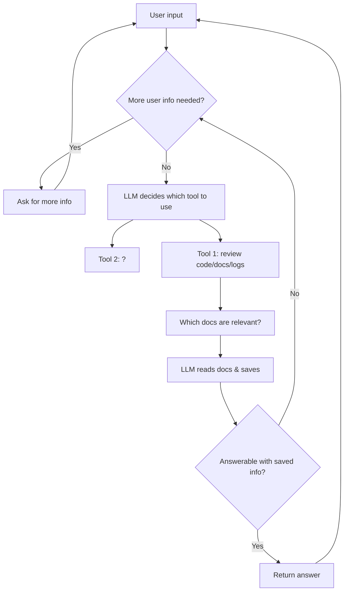

#  Nebari Doctor

This plugin uses an AI agent to attempt to diagnose your issue with Nebari.


# Set up the environment
Run the following from top level dir:
```bash
conda env create -f environment.yaml
conda activate nebari-doctor
pip install -e .
```

# Run the Demo
- Deploy Nebari
- [Set up kubectl access](https://www.nebari.dev/docs/how-tos/debug-nebari/#generating-the-kubeconfig)
- Set `OPENAI_API_KEY` env var locally
- Run the demo with `python -m nebari_doctor`

# Run Normally
- same as the demo except pass in the config file as well
- `nebari doctor --config nebari-config.yaml`

# Features
- 🤖 AI-powered diagnostics for Nebari issues
- 🎨 Beautiful, color-coded interface for easy reading
- 🔍 Intelligent analysis of pod logs and configuration
- 💬 Interactive chat experience with the diagnostic agent

# Agent Workflow
- User enters issue they are seeing
- LLM decides whether more info is needed from user or if the issue is clear enough to start looking at logs.  If more info needed from user, then ask for more and then repeat this step.
- LLM decides which logs are likely relevant and fit in context limit
- LLM reads these logs and saves relevant logs to memory
- LLM assesses whether it can answer the question with the saved logs, or whether more logs or user interaction may be useful.
- If more logs or user interaction is needed go to the 2nd bullet point.
- Otherwise return the answer to the user and allow the user to continue chatting if needed.


