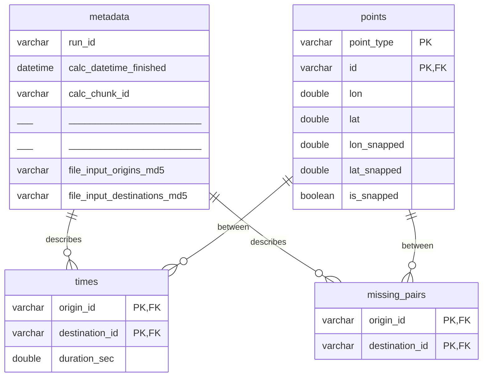

# OpenTimes

#### [About OpenTimes](https://opentimes.org/about) | [Interactive Map](https://opentimes.org) | [Data Directory](https://data.opentimes.org)

**OpenTimes** is a database of pre-computed, point-to-point travel times between
United States Census geographies. The travel times are stored as partitioned
[Parquet files](https://en.wikipedia.org/wiki/Apache_Parquet),
which allows them to be [downloaded directly](#direct-download), read using
various libraries, or queried with SQL using [DuckDB](#using-duckdb).

Below is an example of the main travel time data (sourced from
[this file](https://data.opentimes.org/times/version=0.0.1/mode=car/year=2024/geography=county/state=17/)),
where the `id`-suffixed columns are Census
[GEOIDs](https://www.census.gov/programs-surveys/geography/guidance/geo-identifiers.html)
for counties and `duration_sec` is the driving time between the centroids of
those counties (in seconds).

| origin_id | destination_id | duration_sec |
|:---------:|:--------------:|-------------:|
| 17031     | 17031          | 0            |
| 17031     | 17043          | 1926         |
| 17031     | 17197          | 3080         |
| 17031     | 18089          | 3463         |
| ...       | ...            | ...          |

OpenTimes is essentially just a few hundred billion records that look exactly
like this, compressed and stored in a way that makes them easy to use and
cheap to serve.

## Getting the data

### Direct download

OpenTimes has a [file directory](https://data.opentimes.org) of all its public
files. Individual Parquet files can be downloaded with a click. They can also
be read directly into your software of choice using open-source libraries:

```r
# Using R's arrow implementation
library(arrow)

times <- read_parquet(paste0(
  "https://data.opentimes.org/times/version=0.0.1/mode=car/year=2024",
  "/geography=tract/state=17/times-0.0.1-car-2024-tract-17-0.parquet"
))
```

```python
# Using Python's pandas
import pandas as pd

times = pd.read_parquet((
    "https://data.opentimes.org/times/version=0.0.1/mode=car/year=2024"
    "/geography=tract/state=17/times-0.0.1-car-2024-tract-17-0.parquet"
))

# Or the equivalent in polars
import polars as pl

times = pl.read_parquet((
    "https://data.opentimes.org/times/version=0.0.1/mode=car/year=2024"
    "/geography=tract/state=17/times-0.0.1-car-2024-tract-17-0.parquet"
))
```

### Using DuckDB

In addition to individual files, OpenTimes also provides DuckDB
[pointer databases](https://data.opentimes.org/databases/). These database
files contain _links_ to all the relevant static Parquet files
in [each table](#tables). That means the entire OpenTimes database
can be queried directly with SQL. For example, using R:

```r
library(DBI)
library(duckdb)

# Create a temporary database in memory and attach to the pointer database
conn <- dbConnect(duckdb(), dbdir = ":memory:")
dbExecute(
  conn = conn, "
  INSTALL httpfs;
  LOAD httpfs;
  ATTACH 'https://data.opentimes.org/databases/0.0.1.duckdb' AS opentimes;"
)

# Query only tract-level times starting from Cook County, Illinois
times <- dbGetQuery(
  conn = conn, "
  SELECT origin_id, destination_id, duration_sec
  FROM opentimes.public.times
  WHERE version = '0.0.1'
      AND mode = 'car'
      AND year = '2024'
      AND geography = 'tract'
      AND state = '17'
      AND origin_id LIKE '17031%'"
)
```

Or Python:

```python
import duckdb

# Create a temporary database in memory and attach to the pointer database
conn = duckdb.connect(database=":memory:")
conn.execute("""
  INSTALL httpfs;
  LOAD httpfs;
  ATTACH 'https://data.opentimes.org/databases/0.0.1.duckdb' AS opentimes;
""")

# Query only tract-level times starting from Cook County, Illinois
times = conn.execute("""
  SELECT origin_id, destination_id, duration_sec
  FROM opentimes.public.times
  WHERE version = '0.0.1'
      AND mode = 'car'
      AND year = '2024'
      AND geography = 'tract'
      AND state = '17'
      AND origin_id LIKE '17031%'
""").fetchdf()

```

Some notes on using DuckDB:

- Use as many [partition keys](#partitioning) as possible in the `WHERE`
  clause of your query. Similarly, specify only the columns you _need_ in
  `SELECT`. Doing both of these will greatly increase query speed.
- The OpenTimes data is pretty big — roughly 140 billion rows and 500GB
  _compressed_. If you try to `SELECT *` the whole `times` table you'll
  probably crash DuckDB. Be warned.
- Conversely, querying individual pairs using DuckDB is highly performant. If
  you specify all partition keys, an origin ID, and a destination ID, you'll
  usually get a response in a few seconds.

## Example queries

Below are some common query patterns for OpenTimes using DuckDB.

#### Get pair coordinates

Match the GEOID of the Census geography to its respective coordinates from
the `points` table. These are the coordinates _after_ they're snapped to the
OSM network.

```sql
SELECT
    po.lon_snapped AS origin_x,
    po.lat_snapped AS origin_y,
    pd.lon_snapped AS destination_x,
    pd.lat_snapped AS destination_y,
    t.duration_sec
FROM opentimes.public.times t
LEFT JOIN opentimes.public.points po
    ON t.origin_id = po.id
    AND po.mode = t.mode
    AND po.year = t.year
    AND po.geography = t.geography
    AND po.state = t.state
    AND po.point_type = 'origin'
LEFT JOIN opentimes.public.points pd
    ON t.destination_id = pd.id
    AND pd.mode = t.mode
    AND pd.year = t.year
    AND pd.geography = t.geography
    AND pd.state = t.state
    AND pd.point_type = 'destination'
WHERE t.version = '0.0.1'
    AND t.mode = 'car'
    AND t.year = '2024'
    AND t.geography = 'tract'
    AND t.state = '17'
    AND t.origin_id LIKE '17031%'"
```

## Coverage

OpenTimes data covers and includes times for:

- All 50 states plus Washington D.C.
- All years after 2020 (inclusive)
- The following Census geographies
  (see [this chart](https://www2.census.gov/geo/pdfs/reference/geodiagram.pdf)
  for the relationship hierarchy):
  - States
  - Counties
  - County subdivisions
  - Tracts
  - Block groups
  - ZCTAs (ZIP codes)

All routing is performed from each origin in a state to all destinations
in the same state _plus a 300km buffer around the state_. Routing only occurs
between geographies of the same type i.e. tracts route to tracts, counties to
counties, etc.

Data is updated once new Census geographies are released (usually fall of
a given year). Yearly updates are considered a [SemVer](https://semver.org)
minor version. Small data corrections and tweaks are typically patch versions.

## Limitations

OpenTimes is relatively _complete_ (i.e. there are few missing pairs),
but still has major limitations:

- It doesn't include traffic data. Traffic is basically assumed to be
  free-flowing at the maximum speed limit allowed by OpenStreetMap tags. As
  a result, times tend to be optimistic (greatly so in cities). Traffic data
  is expensive, usually proprietary, and hard-to-come-by, so this isn't likely
  to be fixed soon.
- OSRM routing is imprecise compared to something like Google Maps or even
  [Valhalla](https://github.com/valhalla/valhalla). It doesn't have
  elevation handling, accurate turn penalties, administrative boundaries, or
  a whole host of other accuracy-increasing measures.
- No transit times are included. I couldn't find a routing engine fast enough
  to do continent-scale transit routing. This may change in the future if
  Valhalla adds multi-modal support to their Matrix API.
- Travel distances are limited to within a state plus a 300km buffer around
  it. This limit is self-imposed in order to make routing work on GitHub
  Actions (only a tiny portion of the national OSRM graph can fit in runner
  memory).

## Database structure

### Tables

OpenTimes is made up of four tables, each of which is stored in a separate set
of static files. Each table contains the columns specified below, in addition
to the [partition columns](#partitioning) shared by all tables.

#### 1. times

This is the primary table and contains origin-destination pairs and the
travel time between each pair.

| Column                  | Type         | Description                                                                                                                                            |
|:------------------------|:-------------|:-------------------------------------------------------------------------------------------------------------------------------------------------------|
| `origin_id`             | varchar      | GEOID of the Census geography centroid that routing _started at_.                                                                                      |
| `destination_id`        | varchar      | GEOID of the Census geography centroid that routing _ended at_.                                                                                        |
| `duration_sec`          | double       | Travel time in seconds between the points. There is no maximum duration, however routing only occurs between points in the same state + a buffer.      |

#### 2. points

Describes the location of each origin and destination point in space.

| Column                        | Type      | Description                                                                                                             |
|:------------------------------|:----------|:------------------------------------------------------------------------------------------------------------------------|
| `point_type`                  | varchar   | One of `"origin"` or `"destination"`. Corresponds to the equivalent column in the `times` table.                        |
| `id`                          | varchar   | Census GEOID of the point. Joins to the `times` ID columns.                                                             |
| `lon` / `lat`                 | double    | Coordinates of the GEOID's _population-weighted_ centroid.                                                              |
| `lon_snapped` / `lat_snapped` | double    | Coordinates after being snapped to the nearest OpenStreetMap way. Snap location changes based on routing mode.          |
| `is_snapped`                  | boolean   | Boolean. `True` if the point moved from its original location.                                                          |

#### 3. metadata

Information about how the times were generated, what inputs were used, how long
it took, etc. Note that `chunk` columns are mostly for diagnostic purposes and
don't affect the public files.

| Column                        | Type      | Description                                                                                                                                         |
|:------------------------------|:----------|:----------------------------------------------------------------------------------------------------------------------------------------------------|
| `run_id`                      | varchar   | Unique identifier for the run/outputs                                                                                                               |
| `calc_datetime_finished`      | datetime  | The datetime when routing finished.                                                                                                                 |
| `calc_time_elapsed_sec`       | int       | The time elapsed for the routing, in seconds.                                                                                                       |
| `calc_chunk_id`               | varchar   | Identifier for the chunk, where numbers to the left of the underscore index the origins file, and numbers to the right index the destinations file. |
| `calc_chunk_n_origins`        | int       | Number of origin points in the chunk.                                                                                                               |
| `calc_chunk_n_destinations`   | int       | Number of destination points in the chunk.                                                                                                          |
| `calc_n_origins`              | int       | Total number of origin points in the calculation.                                                                                                   |
| `calc_n_destinations`         | int       | Total number of destination points in the calculation.                                                                                              |
| `calc_n_pairs`                | int       | Total number of origin-destination pairs in the calculation, excluding missing pairs.                                                               |
| `calc_n_missing_pairs`        | int       | Number of missing origin-destination pairs in the calculation.                                                                                      |
| `git_commit_sha_short`        | varchar   | Short version of the Git commit SHA.                                                                                                                |
| `git_commit_sha_long`         | varchar   | Long version of the Git commit SHA.                                                                                                                 |
| `param_network_buffer_m`      | int       | Network buffer parameter in meters.                                                                                                                 |
| `param_destination_buffer_m`  | int       | Destination buffer parameter in meters.                                                                                                             |
| `param_max_split_size`        | int       | Maximum split size parameter.                                                                                                                       |
| `param_use_snapped`           | boolean   | Boolean if snapped points were used.                                                                                                                |
| `file_input_origins_md5`      | varchar   | MD5 checksum of the input origins file.                                                                                                             |
| `file_input_destinations_md5` | varchar   | MD5 checksum of the input destinations file.                                                                                                        |

#### 4. missing_pairs

This is essentially just the `NULL` values of the `times` table; it
contains point pairs that were unroutable for various reasons. These are kept
separate because it seems to help with Parquet compression. The most common
cause of a pair being unroutable is one point being on an island.

### ER Diagram



### Partitioning

OpenTimes uses [Hive-style partitioning](https://duckdb.org/docs/data/partitioning/hive_partitioning.html)
to split its tables into smaller files and save space. Files are split by
partition keys and organized into folders. Visit the
[data directory](https://data.opentimes.org)
to see the full file structure.

All tables use the following partition keys, in order:

| Partition Key   | Description                                                                                                                                                                                                                         |
|:----------------|:------------------------------------------------------------------------------------------------------------------------------------------------------------------------------------------------------------------------------------|
| `version`       | The OpenTimes data release version. Follows [Semantic Versioning](https://semver.org).                                                                                                                                              |
| `mode`          | Travel mode. Currently one of `"car"`, `"bicycle"`, or `"foot"`, where each corresponds to one of the default Open Source Routing Machine [profiles](https://github.com/project-osrm/osrm-backend/blob/master/profiles/car.lua).    |
| `year`          | Census geography and OpenStreetMap data year. Origin and destinations points are pulled from the TIGER/Line files. OSM data is from archived [Geofabrik North America extracts](https://download.geofabrik.de/north-america.html#). |
| `geography`     | Census geography type. See [Coverage](#coverage).                                                                                                                                                                                   |
| `state`         | Census state-level [FIPS code](https://en.wikipedia.org/wiki/Federal_Information_Processing_Standard_state_code). Includes all 50 states and Washington D.C.                                                                        |
| `centroid_type` | Census geography centroid type, one of `"weighted"` or `"unweighted"`. Currently only weighted centroids are used.                                                                                                                  |
| `chunk_id`      | Not technically a partition key. This value is derived from the filename of each Parquet file after it is written to a staging bucket. It is included in most tables but can be ignored for most use cases.                         |

Specifying partition key values when reading or joining files is highly
recommended, as most query engines
[will skip](https://duckdb.org/docs/data/partitioning/hive_partitioning.html#filter-pushdown)
reading any unnecessary files. See the [Using DuckDB](#using-duckdb) section for an example.

## License

OpenTimes uses the [MIT](https://www.tldrlegal.com/license/mit-license) license.
Input data is from [OpenStreetMap](https://www.openstreetmap.org) and the
[U.S. Census](https://www.census.gov). The basemap on the homepage is
from [OpenFreeMap](https://openfreemap.org). Times are calculated using
[OSRM](https://project-osrm.org).

## Attribution

Attribution is required when using OpenTimes data.

Please see the [CITATION file](./CITATION.cff).
You can also generate APA and BibTeX citations directly from the
project sidebar above.
