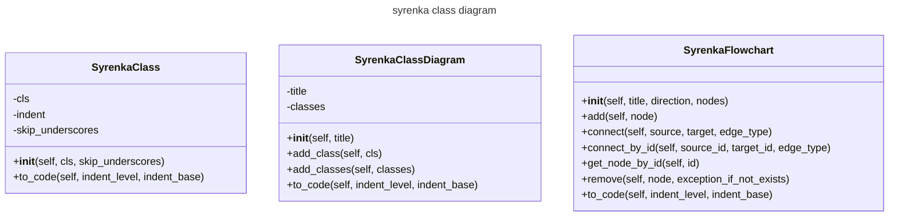

# syrenka
syrenka is mermaid markdown generator

## Description

The aim of this project is to provide easy to use classes for generating mermaid charts and diagrams.

## Installation

`pip install syrenka`

## Example

Here are current classes with names starting with "Syrenka" in syrenka module:



So how do we get it?
This is a code snippet that does it:

```python
import syrenka
from syrenka.base import generate_class_list_from_module

class_diagram  = syrenka.SyrenkaClassDiagram("syrenka class diagram")
class_diagram.add_classes(generate_class_list_from_module(module_name="syrenka", starts_with="Syrenka"))

for line in class_diagram.to_code():
    print(line)
```

and the output:
```cmd
---
title: syrenka class diagram
---
classDiagram
    class SyrenkaClass{
        -cls
        -indent
        -skip_underscores
        +__init__(self, cls, skip_underscores)
        +to_code(self, indent_level, indent_base)
    }
    class SyrenkaClassDiagram{
        -title
        -classes
        +__init__(self, title)
        +add_class(self, cls)
        +add_classes(self, classes)
        +to_code(self, indent_level, indent_base)
    }
    class SyrenkaFlowchart{
        +__init__(self, title, direction, nodes)
        +add(self, node)
        +connect(self, source, target, edge_type)
        +connect_by_id(self, source_id, target_id, edge_type)
        +get_node_by_id(self, id)
        +remove(self, node, exception_if_not_exists)
        +to_code(self, indent_level, indent_base)
    }

```

ready to use mermaid markdown

