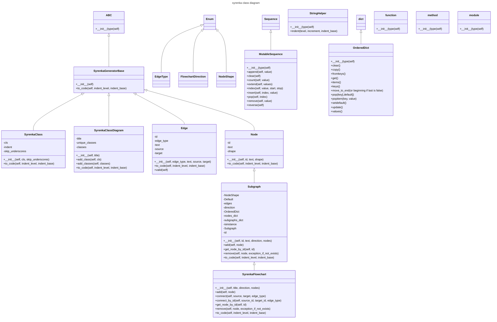

# syrenka
syrenka is mermaid markdown generator

## Description

The aim of this project is to provide easy to use classes for generating mermaid charts and diagrams.

## Installation

`pip install syrenka`

## Example

Here are current classes with names starting with "Syrenka" in syrenka module:

<!-- EX1_MERMAID_DIAGRAM_BEGIN -->

<!-- EX1_MERMAID_DIAGRAM_END -->

So how do we get it?
This is a code snippet that does it:

<!-- EX1_SYRENKA_CODE_BEGIN -->
```python
import syrenka
from syrenka.base import generate_class_list_from_module, classes_in_module

class_diagram  = syrenka.SyrenkaClassDiagram("syrenka class diagram")
#class_diagram.add_classes(generate_class_list_from_module(module_name="syrenka", starts_with="Syrenka"))
class_diagram.add_classes(classes_in_module(module_name="syrenka", nested=True))

for line in class_diagram.to_code():
    print(line) 
```
<!-- EX1_SYRENKA_CODE_END -->

and the output:
<!-- EX1_MERMAID_DIAGRAM_RAW_BEGIN -->
```cmd
---
title: syrenka class diagram
---
classDiagram
    class SyrenkaClass{
        -cls
        -indent
        -skip_underscores
        +\_\_init\_\_(self, cls, skip_underscores)
        +to_code(self, indent_level, indent_base)
    }
    SyrenkaGeneratorBase <|-- SyrenkaClass
    class SyrenkaClassDiagram{
        -title
        -unique_classes
        -classes
        +\_\_init\_\_(self, title)
        +add_class(self, cls)
        +add_classes(self, classes)
        +to_code(self, indent_level, indent_base)
    }
    SyrenkaGeneratorBase <|-- SyrenkaClassDiagram
    class SyrenkaFlowchart{
        +\_\_init\_\_(self, title, direction, nodes)
        +add(self, node)
        +connect(self, source, target, edge_type)
        +connect_by_id(self, source_id, target_id, edge_type)
        +get_node_by_id(self, id)
        +remove(self, node, exception_if_not_exists)
        +to_code(self, indent_level, indent_base)
    }
    Subgraph <|-- SyrenkaFlowchart
    class Edge{
        -id
        -edge_type
        -text
        -source
        -target
        +\_\_init\_\_(self, edge_type, text, source, target)
        +to_code(self, indent_level, indent_base)
        +valid(self)
    }
    SyrenkaGeneratorBase <|-- Edge
    class EdgeType{
    }
    Enum <|-- EdgeType
    class Enum{
    }
    class FlowchartDirection{
    }
    Enum <|-- FlowchartDirection
    class MutableSequence{
        +\_\_init\_\_(type(self)
        +append(self, value)
        +clear(self)
        +count(self, value)
        +extend(self, values)
        +index(self, value, start, stop)
        +insert(self, index, value)
        +pop(self, index)
        +remove(self, value)
        +reverse(self)
    }
    Sequence <|-- MutableSequence
    class Node{
        -id
        -text
        -shape
        +\_\_init\_\_(self, id, text, shape)
        +to_code(self, indent_level, indent_base)
    }
    SyrenkaGeneratorBase <|-- Node
    class NodeShape{
    }
    Enum <|-- NodeShape
    class OrderedDict{
        +\_\_init\_\_(type(self)
        +clear()
        +copy()
        +fromkeys()
        +get()
        +items()
        +keys()
        +move_to_end(or beginning if last is false)
        +pop(key[,default])
        +popitem(key, value)
        +setdefault()
        +update()
        +values()
    }
    dict <|-- OrderedDict
    class StringHelper{
        +\_\_init\_\_(type(self)
        +indent(level, increment, indent_base)
    }
    class Subgraph{
        -NodeShape
        -Default
        -edges
        -direction
        -OrderedDict
        -nodes_dict
        -subgraphs_dict
        -isinstance
        -Subgraph
        -id
        +\_\_init\_\_(self, id, text, direction, nodes)
        +add(self, node)
        +get_node_by_id(self, id)
        +remove(self, node, exception_if_not_exists)
        +to_code(self, indent_level, indent_base)
    }
    Node <|-- Subgraph
    class SyrenkaGeneratorBase{
        +\_\_init\_\_(self)
        +to_code(self, indent_level, indent_base)
    }
    ABC <|-- SyrenkaGeneratorBase
    class ABC{
        +\_\_init\_\_(type(self)
    }
    class function{
        +\_\_init\_\_(type(self)
    }
    class method{
        +\_\_init\_\_(type(self)
    }
    class module{
        +\_\_init\_\_(type(self)
    }
```
<!-- EX1_MERMAID_DIAGRAM_RAW_END -->

ready to use mermaid markdown

