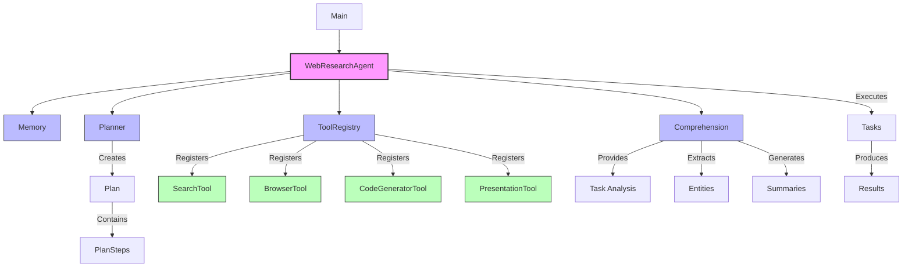

# Web Research Agent

An intelligent AI agent that can research complex topics by browsing the web, extracting relevant information, recognizing entities, and generating structured reports. The agent leverages a modern web browser, Google search, and AI language models to provide comprehensive answers to research questions.

## Features

- **Automated Web Research**: Search the web and browse pages to find information
- **Entity Recognition**: Automatically identify people, organizations, roles, and other entities
- **Adaptive Search**: Refine searches based on previously discovered information
- **Information Synthesis**: Combine information from multiple sources
- **Task Analysis**: Automatically determine the best approach to research tasks
- **Structured Output**: Organize findings into well-formatted reports
- **Code Generation**: Write code when required for data processing tasks

## Architecture



## Installation

### Prerequisites

- Python 3.9 or higher
- pip (Python package installer)

### Setup

1. Clone the repository:
   ```bash
   git clone https://github.com/yourusername/web_research_agent.git
   cd web_research_agent
   ```

2. Create a virtual environment:
   ```bash
   python -m venv venv
   source venv/bin/activate  # On Windows: venv\Scripts\activate
   ```

3. Install dependencies:
   ```bash
   pip install -r requirements.txt
   ```

## Configuration

The agent requires API keys to function properly:

1. **Gemini API key**: For LLM services
2. **Serper API key**: For Google search results

### Setting up your API keys

#### Option 1: .env file (Recommended)

Create a `.env` file in the project root:

```bash
GEMINI_API_KEY=your_gemini_api_key
SERPER_API_KEY=your_serper_api_key
```

The agent will automatically load this file.

#### Option 2: Environment Variables

```bash
export GEMINI_API_KEY=your_gemini_api_key
export SERPER_API_KEY=your_serper_api_key
```

#### Option 3: Programmatically

```python
from config.config_manager import init_config

config = init_config()
config.update('gemini_api_key', 'your_gemini_api_key')
config.update('serper_api_key', 'your_serper_api_key')
```

### Additional Configuration Options

| Config Key | Environment Variable | Description | Default |
|------------|---------------------|-------------|---------|
| gemini_api_key | GEMINI_API_KEY | API key for Google's Gemini LLM | - |
| serper_api_key | SERPER_API_KEY | API key for Serper.dev search | - |
| log_level | LOG_LEVEL | Logging level | INFO |
| max_search_results | MAX_SEARCH_RESULTS | Maximum number of search results | 5 |
| memory_limit | MEMORY_LIMIT | Number of items to keep in memory | 100 |
| output_format | OUTPUT_FORMAT | Format for output (markdown, text, html) | markdown |
| timeout | REQUEST_TIMEOUT | Default timeout for web requests (seconds) | 30 |

## Usage

### Basic Usage

1. Create a text file with your research tasks, one per line:
   ```
   # tasks.txt
   Find the name of the COO of the organization that mediated secret talks between US and Chinese AI companies in Geneva in 2023.
   By what percentage did Volkswagen reduce their Scope 1 and Scope 2 greenhouse gas emissions in 2023 compared to 2021?
   ```

2. Run the agent:
   ```bash
   python main.py tasks.txt
   ```

3. Results will be saved to the `results/` directory as Markdown files.

### Command Line Options

```bash
python main.py tasks.txt --output custom_output_dir
```

| Option | Description | Default |
|--------|-------------|---------|
| task_file | Path to text file containing tasks | (required) |
| --output | Directory to store results | results/ |

## Project Structure

- **agent/**: Core agent components
  - **agent.py**: Main agent class
  - **comprehension.py**: Text understanding capabilities
  - **memory.py**: Memory management
  - **planner.py**: Plan creation and management
  
- **tools/**: Tools used by the agent
  - **browser.py**: Web browsing tool
  - **search.py**: Web search tool
  - **code_generator.py**: Code generation tool
  - **presentation_tool.py**: Information formatting
  - **tool_registry.py**: Tool registration system

- **utils/**: Utility functions
  - **console_ui.py**: Console interface
  - **formatters.py**: Output formatting
  - **logger.py**: Logging configuration

- **config/**: Configuration management
  
- **main.py**: Entry point

## Advanced Usage

### Entity Extraction

The agent can automatically identify and extract entities from content:

- **People**: Names of individuals
- **Organizations**: Companies, agencies, groups
- **Roles**: Job titles and organizational positions
- **Locations**: Physical places
- **Dates**: Temporal references

This feature helps the agent refine searches and identify key information.

### Custom Output Formats

You can customize the output format by setting the `output_format` configuration:

```python
from config.config_manager import init_config

config = init_config()
config.update('output_format', 'html')  # Options: markdown, json, html
```

## Troubleshooting

### Common Issues

1. **URL Access Errors**: Some websites block automated access. Try using a different source.
2. **API Rate Limiting**: If you receive rate limit errors, space out your requests or use a premium API plan.
3. **Memory Issues**: For very large research tasks, you may need to increase your system's memory allocation.

### Error Logs

Logs are stored in the `logs/` directory for debugging.

## Contributing

Contributions are welcome! Please feel free to submit a Pull Request. Check out the [CONTRIBUTING.md](CONTRIBUTING.md) file for more details.
